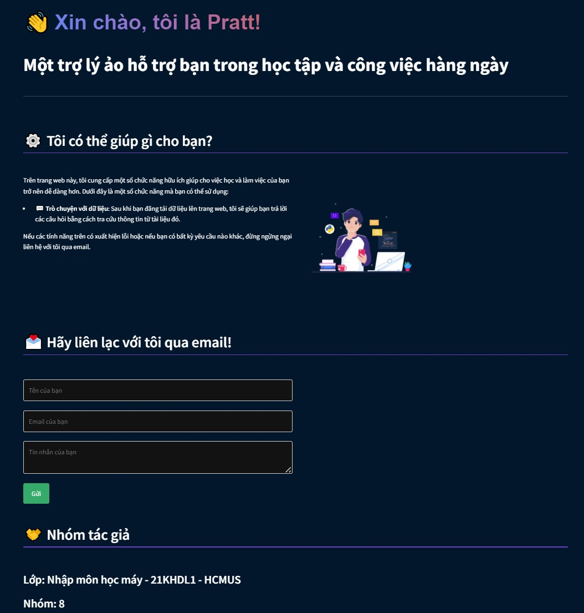
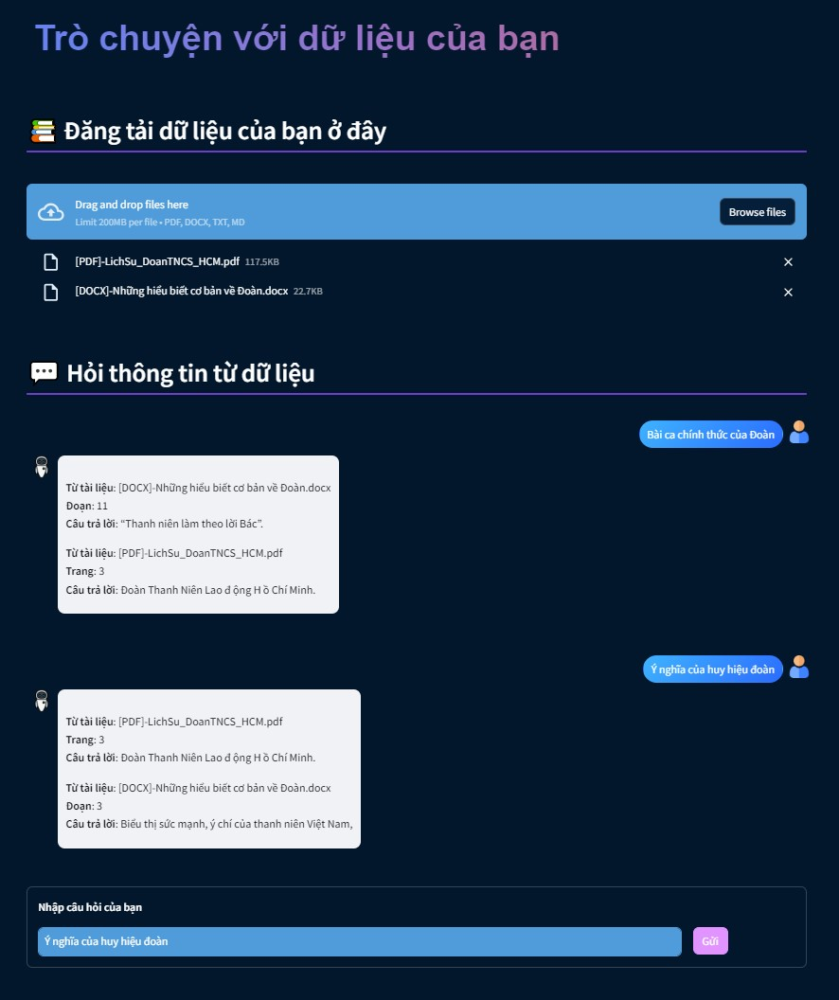

# FinalProject_MachineLearning

## Template cho từng chức năng

- Tên chức năng: <...>
  - Mô tả chức năng: <...>
  - Tên file chạy chức năng: <...>.py

---

Ví dụ:

- Tên chức năng: Trò chuyện với dữ liệu
  - Mô tả chức năng: Sau khi bạn đăng tải dữ liệu lên trang web, tôi sẽ giúp bạn trả lời các câu hỏi bằng cách tra cứu thông tin từ tài liệu đó.
  - Tên file chạy chức năng: chat_documents.py

## Phần Report cho từng chức năng

- Viết Markdown
- Trình bày chức năng hoạt động như thế nào:
  - Chụp hình demo cho chức năng
- Trình bày kiến trúc của mô hình thực hiện chức năng đó:
  - Vẽ kiến trúc mô hình (dạng đơn giản trong slide)  
    

```
# 1. Thông tin nhóm

# 2. Giới thiệu đề tài (lý do chọn làm ứng dụng):
    - Trình bày lí do chọn đề tài, mục đích, đối tượng và phạm vi nghiên cứu.
    - End-user = ???

# 3. TRÌNH BÀY, ĐÁNH GIÁ, BÀN LUẬN VỀ CÁC KẾT QUẢ của chức năng (quan trọng nhất):
    - Chức năng cho ra kết quả tốt khi ...
    - Khi số lượng vật thể tăng lên thì kết quả giảm độ chính xác.
    - v.v.

# 4. KẾT LUẬN: Trình bày những kết quả đạt được, những đóng góp mới và những đề xuất mới. Phần kết luận cần ngắn gọn, không có lời bàn và bình luận thêm.

# 5. HƯỚNG PHÁT TRIỂN: Kiến nghị về những hướng nghiên cứu tiếp theo
    - Nếu có thêm thời gian, tài nguyên, v.v. thì nhóm sẽ làm thêm chức năng gì, cải tiến các chức năng sẵn có ra sao, v.v.

# 6. DANH MỤC TÀI LIỆU THAM KHẢO
```

## Demo

### Homepage



### Chat with documents


