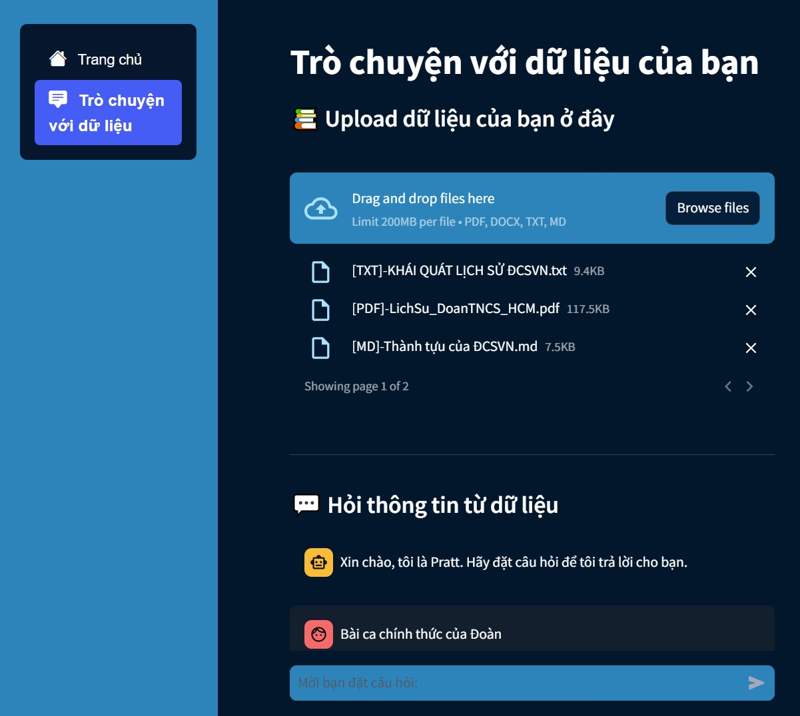

# FinalProject_MachineLearning

## Template cho từng chức năng

- Tên chức năng: <...>
  - Mô tả chức năng: <...>
  - Tên file chạy chức năng: <...>.py

---

Ví dụ:

- Tên chức năng: Trò chuyện với dữ liệu
  - Mô tả chức năng: Sau khi bạn đăng tải dữ liệu lên trang web, tôi sẽ giúp bạn trả lời các câu hỏi bằng cách tra cứu thông tin từ tài liệu đó.
  - Tên file chạy chức năng: chat_documents.py

## Demo

### Homepage

### Chat with documents

