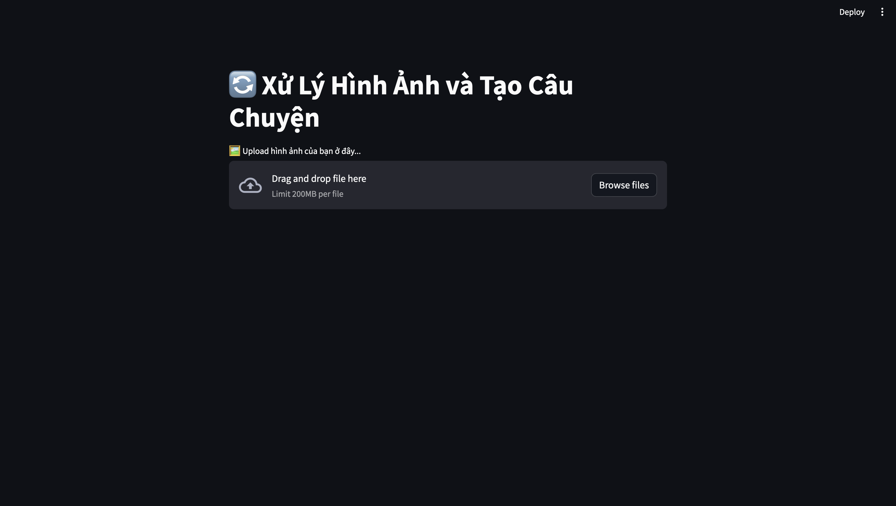
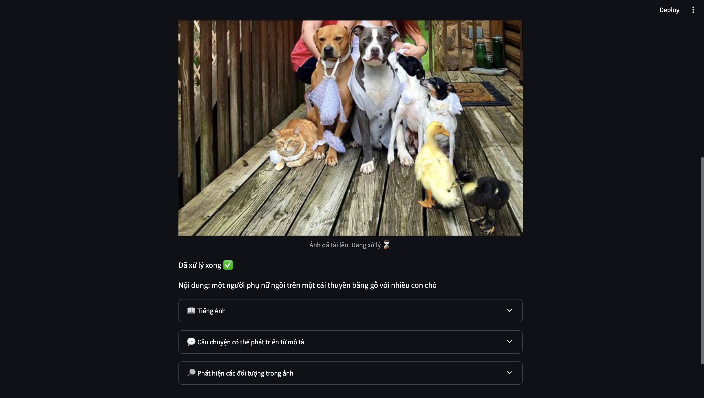
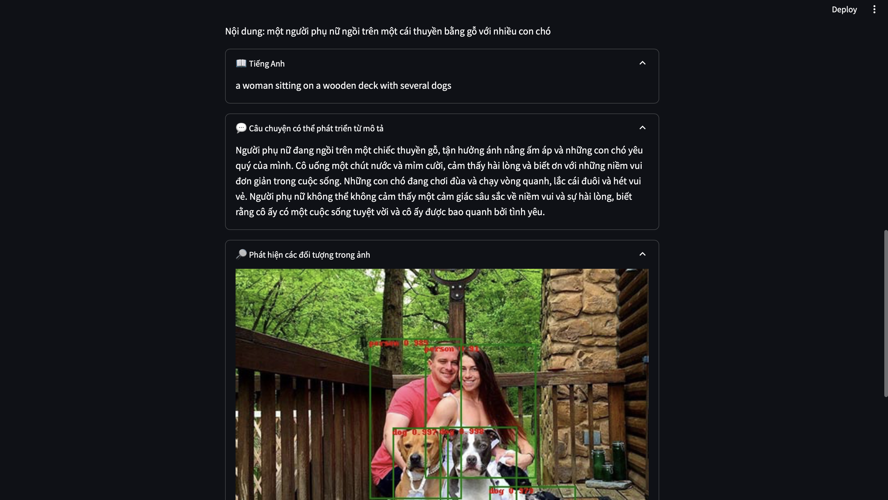

# FinalProject_MachineLearning

- Tên chức năng: Xử lý hình ảnh và Tạo câu chuyện
    - Mô tả chức năng: Sau khi đăng tải hình ảnh lên trang web, tôi sẽ cho bạn 1 câu có thể gọi là tiêu đề để tóm tắt nội dung của hình ảnh được đăng tải. Kèm theo đó là lựa chọn có thể xem câu tiêu đề ấy bằng tiếng anh. Bên cạnh đó, dựa vào tiêu đề, tôi có thể phát triển ra 1 câu chuyện nhỏ để mô tả rõ hơn về hình ảnh. Cuối cùng là tính năng có thể phát hiện các object có trên bức hình.
    - Tên file chạy chức năng: app.py

# Report

## Giao diện và chức năng hoạt động

- Nhấn chọn Browse files để load hình ảnh bạn muốn xử lý
- Sau khi hình ảnh đã được load lên sẽ có giao diện như sau:

- Nội dung tóm tắt của hình ảnh sẽ được hiển thị ngay bên dưới hình ảnh.
- Đi cùng với đó là 3 mục bạn có thể chọn để xem bao gồm: Tiếng Anh, Câu chuyện có thể phát triển từ mô tả, Phát hiện các đối tượng trong ảnh.

- Với mục Tiếng Anh, bạn có thể xem mô tả của bức ảnh bằng tiếng Anh.
- Với mục Câu chuyện có thể phát triển từ mô tả, bạn có thể xem 1 câu chuyện ngắn được phát triển từ đoạn mô tả bức ảnh để có thể hình dung tổng quát nội dung của bức ảnh.
- Với mục Phát hiện các đối tượng trong ảnh, bạn có thể nhận biết được các đối tượng bên trong ảnh.

## Kiến trúc của mô hình thực hiện chức năng
- Image-to-Text Model (Salesforce/blip-image-captioning-base):
    * Sử dụng để chuyển đổi hình ảnh thành văn bản mô tả.
    * Được sử dụng trong hàm img2text(url).
- MBart Model (facebook/mbart-large-50-many-to-many-mmt):
    * Một mô hình ngôn ngữ mạng transformer dựa trên kiến trúc BART (Bidirectional and Auto-Regressive Transformers).
    * Được sử dụng để dịch từ văn bản tiếng Anh sang tiếng Việt.
    * Được sử dụng trong hàm translate_article_Eng_Viet(article_hi) và generate_story(scenario, llm).
- Detr Model (facebook/detr-resnet-50):
    * Một mô hình dùng cho phát hiện đối tượng trong hình ảnh. Sử dụng mô hình DETR (DEtection TRansformer).
    * Được sử dụng để phát hiện đối tượng trong hình ảnh và vẽ bounding boxes và nhãn tương ứng lên ảnh.
    * Được sử dụng trong hàm detect_objects_and_draw_bounding_boxes(url).
- LangChain:
    * Thư viện để tạo câu chuyện dựa trên các mẫu cố định và mô hình ngôn ngữ.
    * Sử dụng để tạo câu chuyện dựa trên mô tả hình ảnh và mô tả văn bản đã dịch sang tiếng Việt.
    * Được sử dụng trong hàm generate_story_from_scenario(scenario).

## Kiến trúc mô hình:

     +---------------------+
     |    Image Upload     |
     +---------------------+
                 |
        +--------v--------+
        | Image-to-Text   |
        +--------+--------+
                 |
        +--------v--------+
        |   Translation   |
        +--------+--------+
                 |
        +--------v--------+
        |    LangChain    |
        +--------+--------+
                 |
        +--------v--------+
        |    DETR Model   |
        +--------+--------+
                 |
        +--------v--------+
        |     Streamlit    |
        +------------------+
