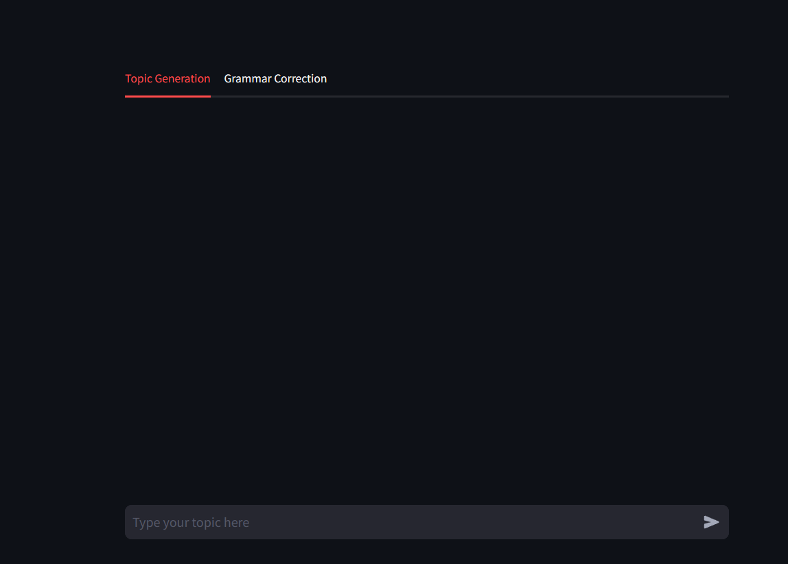
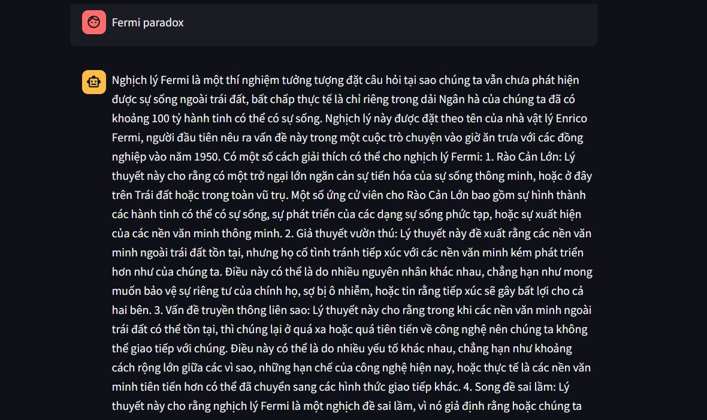
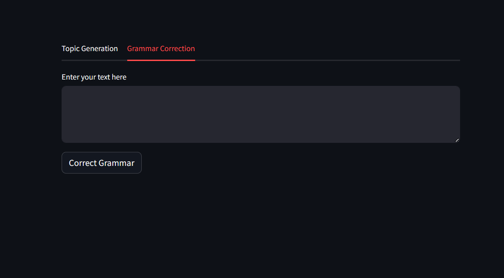
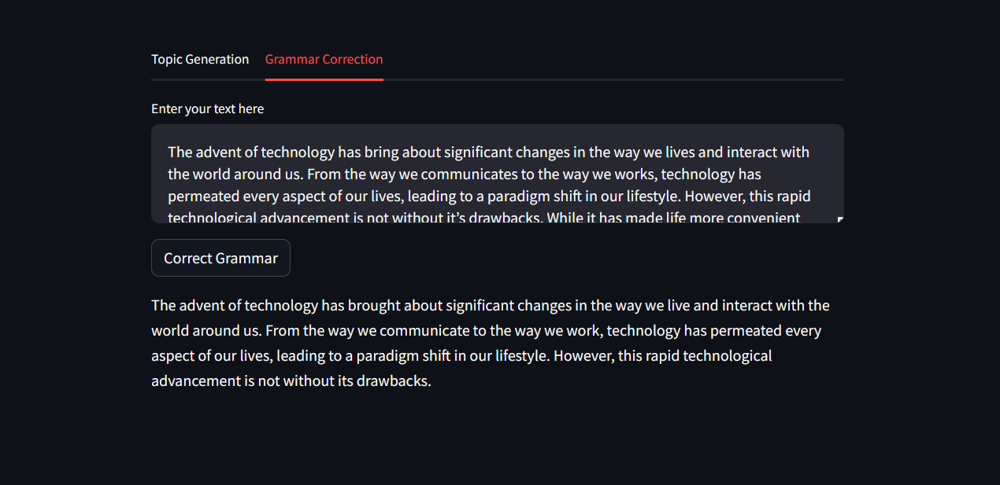

# FinalProject_MachineLearning

- Tên chức năng: Tạo sinh văn bản và sửa lỗi ngữ pháp tiếng Anh
    - Mô tả chức năng: 
	    + Tạo sinh văn bản: Cho một chủ đề và mô hình sẽ cho ra 1 văn bản liên quan tới chủ đề đấy.
	    + Sửa lỗi ngữ pháp: Cho một câu tiếng Anh sai ngữ pháp và mô hình sẽ sửa lỗi.
    - Tên file chạy chức năng: writing_correction.py

# Report

## Giao diện và chức năng hoạt động

### Tạo sinh văn bản

- Cho một chủ đề để mô hình tạo sinh

- Văn bản sẽ được tự động dịch sang tiếng Việt

### Sửa lỗi ngữ pháp

- Cho một đoạn văn hoặc một câu tiếng Anh sai ngữ pháp và mô hình sẽ tự động sửa lỗi.

## Hạn chế
### Sửa lỗi ngữ pháp
- Đôi khi mô hình sẽ không thể sửa được hết tất cả các câu trong 1 đoạn văn bản -> Giải pháp: Nên tách thành các đoạn nhỏ.
