# TRƯỜNG ĐẠI HỌC KHOA HỌC TỰ NHIÊN, ĐHQG-HCM

# KHOA CÔNG NGHỆ THÔNG TIN

# NHẬP MÔN HỌC MÁY - 21KHDL1

# BÁO CÁO ĐỒ ÁN CUỐI KỲ

# CHỦ ĐỀ: XÂY DỰNG AI-BASED WEB APP - PRATT

# 1. Thông tin nhóm và mức độ đóng góp của mỗi thành viên 🤝

- Lớp: Nhập môn học máy - 21KHDL1
- Nhóm: 8
- Danh sách thành viên:

|              Họ và tên | MSSV     | Mức độ đóng góp |
| ---------------------: | :------- | :-------------: |
|             Võ Duy Anh | 21127221 |      100%       |
| Phạm Nguyễn Quốc Thanh | 21127428 |      100%       |
|     Nguyễn Mậu Gia Bảo | 21127583 |      100%       |
|           Vũ Minh Phát | 21127739 |      100%       |

# 2. Giới thiệu đề tài

## 2.1. Sơ lược về AI

&emsp;Trí tuệ nhân tạo (AI) là một lĩnh vực nghiên cứu của khoa học máy tính và khoa học tính toán nói chung. Có nhiều quan điểm khác nhau về trí tuệ nhân tạo và do vậy có nhiều định nghĩa khác nhau về lĩnh vực khoa học này. Mục đích của trí tuệ nhân tạo là xây dựng các "thực thể thông minh". Tuy nhiên, do rất khó định nghĩa thế nào là "thực thể thông minh" nên cũng khó thống nhất định nghĩa trí tuệ nhân tạo. Theo một số tài liệu được sử dụng rộng rãi trong giảng dạy trí tuệ nhân tạo, các định nghĩa có thể nhóm thành bốn nhóm khác nhau. Theo đó, trí tuệ nhân tạo là lĩnh vực nghiên cứu việc xây dựng các hệ thống máy tính có đặc điểm sau:

1. **Hệ thống hành động như con người:** Nhóm này tập trung vào việc tạo ra các hệ thống có thể thực hiện các hành động tương tự như con người, ví dụ như robot có thể di chuyển và tương tác với môi trường xung quanh.
2. **Hệ thống có thể suy nghĩ như con người:** Nhóm này tập trung vào việc mô phỏng quá trình suy nghĩ và tư duy của con người, ví dụ như hệ thống có thể giải quyết vấn đề, học hỏi và đưa ra quyết định.
3. **Hệ thống có thể suy nghĩ hợp lý:** Nhóm này tập trung vào việc tạo ra các hệ thống có thể suy luận và đưa ra kết luận logic, chính xác.
4. **Hệ thống hành động hợp lý:** Nhóm này tập trung vào việc tạo ra các hệ thống có thể lựa chọn hành động hiệu quả nhất để đạt được mục tiêu mong muốn.

&emsp;Trong số các định nghĩa trên, nhóm thứ hai và ba quan tâm tới quá trình suy nghĩ và tư duy, trong khi nhóm thứ nhất và thứ tư quan tâm chủ yếu tới hành vi. Ngoài ra, hai nhóm định nghĩa đầu xác định mức độ thông minh hay mức độ trí tuệ bằng cách so sánh với khả năng suy nghĩ và hành động của con người, trong khi hai nhóm định nghĩa sau dựa trên khái niệm suy nghĩ hợp lý và hành động hợp lý.

&emsp;Việc phân biệt giữa "suy nghĩ và hành động hợp lý" với "suy nghĩ và hành động như người" là điều rất quan trọng. "Hợp lý" đề cập đến việc đưa ra quyết định dựa trên logic và bằng chứng, trong khi "như người" có thể bao gồm cả những yếu tố cảm xúc và phi logic.

&emsp;Nhìn chung, AI là một lĩnh vực rộng lớn và phức tạp với nhiều mục tiêu và cách tiếp cận khác nhau. Nhưng nhờ có sự cố gắng và nỗ lực không ngừng nghỉ của cộng đồng lập trình viên trên toàn thế giới mà hiện nay chúng ta đang được sống trong một thế giới tiến bộ, bao quanh bởi các lợi ích mà công nghệ AI mang lại.

## 2.2. Một số ứng dụng của AI và thành tựu

&emsp;Sự bùng nổ của công nghệ AI trong nhiều năm trở lại đây đã dẫn đến sự ra đời của vô số ứng dụng AI trong mọi lĩnh vực, từ giáo dục, y tế, vận tải đến đời sống thường nhật. Các ứng dụng này đang mang đến những thay đổi to lớn trong cách chúng ta sinh sống, học tập và làm việc. Dưới đây là một số ví dụ tiêu biểu:

#### a. Các chương trình trò chơi:

&emsp;Xây dựng chương trình có khả năng chơi những trò chơi trí tuệ là lĩnh vực có nhiều thành tựu của trí tuệ nhân tạo. Với những trò chơi tương đối đơn giản như cờ ca rô hay cờ thỏ cáo, máy tính đã thắng người từ cách đây vài thập kỷ.

&emsp;Đối với những trò chơi phức tạp hơn, các hệ thống trí tuệ nhân tạo cũng dần đuổi kịp và vượt qua con người. Sự kiện quan trọng thường được nhắc tới là vào tháng 5 năm 1997 chương trình cờ vua Deep Blue của IBM đã thắng vô địch cờ vua thế giới lúc đó là Gary Kasparov. Trong vòng đấu kéo dài 6 ván, Deep Blue thắng Kasparov với điểm số 3.5 : 2.5. Đây là lần đầu tiên máy tính thắng đương kim vô địch cờ vua thế giới.

&emsp;Một trường hợp tiêu biểu khác là hệ thống trả lời tự động Watson cũng của IBM đã chiến thắng hai quán quân của Jeopardy trong trò chơi này vào năm 2011. Jeopardy là trò chơi hỏi đáp trên truyền hình Mỹ, tương tự “Ai là triệu phú” trên truyền hình Việt Nam nhưng trong đó ba người chơi phải thi với nhau không những trả lời đúng mà còn phải nhanh. Watson là hệ thống hỏi đáp do IBM xây dựng dựa trên việc thu thập và phân tích thông tin từ khoảng 200 triệu trang Web, trong đó có toàn bộ Wikipedia. Trong một cuộc đấu với hai cựu quán quân Jeopardy, Watson đã giành thắng lợi và phần thưởng 1 triệu USD. Các kỹ thuật sử dụng trong Watson như thu thập thông tin, phát hiện tri thức, hiểu ngôn ngữ tự nhiên, tìm kiếm, đã được IBM thương mại hóa và có thể sử dụng trong nhiều ứng dụng.

&emsp;Sau nhiều thập kỷ phát triển, các NPC (nhân vật không do người chơi điều khiển) trong game đã đạt được bước tiến vượt bậc nhờ được tối ưu hóa bởi AI. Nhờ vậy, hành động và tương tác của họ trở nên tự nhiên và phù hợp với bối cảnh xung quanh, cũng như hành động của người chơi. Một ví dụ điển hình là hệ thống AI trong trò chơi GTA V, cho phép điều khiển các phương tiện như xe hơi, mô tô một cách thông minh dựa trên tín hiệu giao thông và bản đồ. Điều này tạo nên một thế giới ảo sống động và chân thực hơn, mang đến cho người chơi trải nghiệm game nhập vai ấn tượng. Năm 2025 sắp tới, Rockstar Games hứa hẹn sẽ tiếp tục nâng tầm trải nghiệm game của người chơi với phiên bản GTA VI. Phiên bản này dự kiến sẽ ứng dụng công nghệ AI tiên tiến hơn nữa, giúp NPC trở nên thông minh, tự chủ và có khả năng tương tác với người chơi một cách chân thực hơn bao giờ hết.

&emsp;Sự phát triển của AI trong game mở ra tiềm năng to lớn cho ngành công nghiệp giải trí. Với những NPC thông minh và thế giới ảo sống động, các trò chơi điện tử sẽ mang đến cho người chơi những trải nghiệm ngày càng chân thực và ấn tượng hơn, góp phần thúc đẩy sự phát triển của ngành game trong tương lai.

#### b. Nhận dạng tiếng nói:

&emsp;Nhận dạng tiếng nói là biến đổi từ âm thanh tiếng nói thành các văn bản. Hiện người dùng công cụ tìm kiếm Google có thể đọc vào câu truy vấn thay cho việc gõ từ khóa như trước. Các điện thoại di động thông minh cũng có khả năng nhận dạng giọng nói và trả lời các câu hỏi. Ví dụ điển hình là chương trình trợ giúp Siri trên điện thoại thông minh của Apple (sử dụng công nghệ nhận dạng tiếng nói của hãng Nuance) hay hệ thống Google Now.

&emsp;Chất lượng nhận dạng giọng nói đang được cải thiện và tiến bộ rất nhanh trong vài năm gần đây. Các hệ thống nhận dạng tiếng nói hiện tại cho phép nhận dạng tới vài chục ngôn ngữ khác nhau và không phụ thuộc vào người nói (ở một mức độ nhất định).

#### c. Thị giác máy tính:

&emsp;Mặc dù nhiều ứng dụng của thị giác máy tính vẫn chưa đạt tới độ chính xác như người, nhưng trong một số bài toán, thị giác máy tính cho độ chính xác tương đương hoặc gần với khả năng của người. Tiêu biểu phải kể đến các hệ thống nhận dạng chữ in với độ chính xác gần như tuyệt đối, hệ thống nhận dạng tròng mắt, vân tay, mặt người. Những hệ thống dạng này được sử dụng rộng rãi trong sản xuất để kiểm tra sản phẩm, trong hệ thống camera an ninh. Ứng dụng nhận dạng mặt người trên Facebook được dùng để xác định những người quen xuất hiện trong ảnh và gán nhãn tên cho người đó. Các ứng dụng nhận dạng hiện nay đang được cải thiện nhiều nhờ sử dụng kỹ thuật học sâu (deep learning), trong đó các mạng nơ ron có nhiều lớp được kết nối với nhau được sử dụng để phát hiện các đặc trưng của đối tượng ở mức từ đơn giản tới phức tạp.

#### d. Hệ chuyên gia:

&emsp;Là các hệ thống làm việc dựa trên kinh nghiệm và tri thức của chuyên gia trong một lĩnh vực tương đối hẹp nào đó để đưa ra khuyến cáo, kết luận, chẩn đoán một cách tự động. Một số ví dụ phổ biến bao gồm:

- **MYCIN**: hệ chuyên gia đầu tiên chẩn đoán bệnh về nhiễm trùng máu và cách điều trị với khả năng tương đương một bác sĩ giỏi trong lĩnh vực này.
- **XCON của DEC**: hỗ trợ chọn cấu hình máy tính tự động.

#### e. Xử lý, hiểu ngôn ngữ tự nhiên:

&emsp;Tiêu biểu là các hệ thống dịch tự động như hệ thống dịch của Google, các hệ thống tóm tắt nội dung văn bản tự động. Hệ thống dịch tự động của Google sử dụng các mô hình thống kê xây dựng từ các văn bản song ngữ và các văn bản đơn ngữ. Hệ thống này có khả năng dịch qua lại giữa vài chục ngôn ngữ.

&emsp;Các hệ thống hỏi đáp được đề cập tới trong phần về trò chơi và nhận dạng tiếng nói cũng thuộc loại ứng dụng xử lý ngôn ngữ tự nhiên. Những hệ thống này sử dụng những thành phần đơn giản hơn như các phân hệ phân tích hình thái, cú pháp, ngữ nghĩa.

&emsp;Nhiều kỹ thuật xử lý ngôn ngữ tự nhiên đã được ứng dụng trong các ứng dụng rất thiết thực như các bộ lọc thư rác. Dịch vụ thư điện tử của Google, Microsoft, Yahoo đều có các bộ lọc thư rác với cơ chế học tự động và thích nghi với thay đổi của người phát tán. Khả năng phát hiện thư rác của các hệ thống này là rất cao, gần như tuyệt đối trong một số trường hợp.

#### f. Lập kế hoạch, lập thời khóa biểu:

&emsp;Kỹ thuật trí tuệ nhân tạo được sử dụng nhiều trong bài toán lập thời khóa biểu cho trường học, xí nghiệp, các bài toán lập kế hoạch khác. Một ví dụ lập kế hoạch thành công với quy mô lớn là kế hoạch đảm bảo hậu cần cho quân đội Mỹ trong chiến dịch Cơn bão sa mạc tại Iraq đã được thực hiện gần như hoàn toàn dựa trên kỹ thuật trí tuệ nhân tạo. Đây là một kế hoạch lớn, liên quan tới khoảng 50000 thiết bị vận tải và người tại cùng một thời điểm. Kế hoạch bao gồm điểm xuất phát, điểm tới, thời gian, phương tiện và người tham gia sao cho không mâu thuẫn và tối ưu theo các tiêu chí.

#### h. Rô bốt:

&emsp;Một số rô bốt được xây dựng sao cho có hình dạng tương tự con người và khả năng toàn diện như thị giác máy, giao tiếp bằng ngôn ngữ tự nhiên, khả năng lập luận nhất định, khả năng di chuyển và thực hiện các hành động như nhẩy múa. Các rô bốt này chủ yếu được tạo ra để chứng minh khả năng của kỹ thuật rô bốt thay vì hướng vào ứng dụng cụ thể. Trong số này có thể kể tới rô bốt Asimo, rô bốt Nao. Bên cạnh đó, một số rô bốt không mô phỏng người nhưng được sử dụng trong đời sống hàng ngày hoặc các ứng dụng thực tế. Ví dụ, rô bốt Roomba của hãng iRobot có khả năng tự động di chuyển trong phòng, tránh vật cản, chui vào các ngóc ngách để lau sạch toàn bộ sàn. Số lượng rô bốt Roomba đã bán lên tới vài triệu bản.

#### i. Các thiết bị tự lái:

&emsp;Các thiết bị tự lái bao gồm máy bay, ô tô, tầu thủy, thiết bị thám hiểm vũ trụ có thể tự di chuyển mà không có sự điều khiển của người (cả điều khiển trực tiếp và điều khiển từ xa). Hiện ô tô tự lái đang được một số hãng công nghệ và các tổ chức khác nghiên cứu và phát triển, trong đó có những dự án nổi tiếng như xe tự lái của Tesla. Còn trong lĩnh vực du hành và thám hiểm vũ trụ thì không thể không kể đến xe thám hiểm sao Hỏa của NASA.

&emsp;Năm 2016, công ty Otto sở hữu bởi Uber đã thành công trong việc vận chuyển 50.000 lon bia Budweisers bằng xe vận tải tự lái. Về lợi ích kinh tế, ứng dụng trí tuệ nhân tạo cho vận tải đường dài có thể giảm chi phí, ngoài ra còn giúp hạn chế tối đa những tai nạn chết người.

## 2.3. Ý tưởng của ứng dụng

&emsp;Hiểu được tác động và nhựng lợi ích mà AI có thể đem lại, nhóm 8 đã quyết định xây dựng một trang web có thể ứng dụng AI vào các tác vụ hằng ngày. Để giúp quá trình xây dựng trang web trở nên dễ dàng hơn (đặc biệt là khi các thành viên trong nhóm đều không thực sự rành về lĩnh vực phát triển web) thì nhóm 8 quyết định sử dụng một framework nổi tiếng của python là Streamlit để đơn giản hóa quá trình triển khai các mô hình học máy lên ứng dụng thực tế.

&emsp;Như đã trình bày ở phần trước đó, AI hiện nay có thể được ứng dụng vào hầu hết lĩnh vực trong cuộc sống. Nhưng để xây dựng được một trang web có thể tích hợp toàn bộ chức năng như trên là một điều không thể. Do đó, mỗi thành viên trong nhóm 8 đã lựa chọn cho mình một bài toán mà mỗi người yêu thích nhất để nghiên cứu và phát triển nó trở thành một chức năng của trang web.

&emsp;Cuối cùng, sau một khoảng thời gian nghiên cứu, nhóm 8 đã thành công tạo ra một người trợ lý ảo ở dạng ứng dụng web có tên gọi là Pratt. Pratt sẽ là một người bạn thân thiết, có thể đồng hành với người dùng để hoàn tất mọi tác vụ trong cuộc sống từ học tập đến làm việc. Hiện tại, Pratt có thể hỗ trợ người dùng với một số chức năng chính sau đây:

#### a. Trò chuyện với tài liệu:

&emsp;Sau khi người dùng đăng tải tài liệu lên trang web, Pratt sẽ giúp người dùng trả lời các câu hỏi bằng cách tra cứu thông tin từ tài liệu đó. Hiện tại, Pratt có thể hỗ trợ tra cứu thông tin trên các tập tin phổ biến như: PDF, DOCX, TXT và MD. Bên cạnh việc đưa ra câu trả lời, Pratt còn có thể cung cấp thông tin về vị trí xuất hiện của từ khóa trong tài liệu để giúp người dùng dễ dàng kiểm tra lại thông tin.

#### b. Xử lý hình ảnh và tạo câu chuyện:

&emsp;Sau khi đăng tải bức ảnh lên trang web, Pratt sẽ giúp người dùng tạo ra tiêu đề cho bức ảnh (cả tiếng Việt và tiếng Anh). Bên cạnh đó, dựa vào tiêu đề, Pratt cũng hỗ trợ người dùng phát triển một câu chuyện nhỏ để mô tả rõ hơn về bức ảnh. Cuối cùng là tính năng phát hiện, nhận diện các đối tượng có trên bức ảnh.

#### c. Trình tạo mã nguồn theo yêu cầu:

&emsp;Với chức năng này, người dùng có thể hỏi các vấn đề liên quan đến lập trình, Pratt sẽ phát sinh đoạn mã nguồn đáp ứng yêu cầu của người dùng. Mã nguồn đa dạng ở các ngôn ngữ như: C, C++, Java, Python, v.v.. Ngoài ra, người dùng có thể đăng tải file dữ liệu CSV, Pratt có thể hỗ trợ phát sinh mã nguồn để phân tích, trực quan, thống kê, v.v. từ dữ liệu trong file tương ứng. Người dùng có thể nhập tên file yêu cầu, sau khi hoàn thành, Pratt sẽ tạo file tương ứng để lưu mã nguồn vừa phát sinh.

#### d. Tạo sinh văn bản và sửa lỗi ngữ pháp tiếng Anh:

&emsp;Với chức năng tạo sinh văn bản, người dùng có thể nhập vào một chủ đề và Pratt sẽ giúp người dùng tạo ra một văn bản liên quan đến chủ đề đó.

&emsp;Còn với chức năng sửa lỗi ngữ pháp, người dùng có thể nhập vào một đoạn văn bản tiếng Anh và Pratt sẽ giúp người dùng sửa lỗi ngữ pháp trong văn bản đó.

## 2.4. Ý nghĩa của đề tài

&emsp;Trên thực tế, người trợ lý ảo Pratt chỉ dừng lại ở mức độ là một đồ án của môn học "Nhập môn học máy", giúp sinh viên có cơ hội áp dụng các công nghệ hiện đại để tạo ra một sản phẩm giúp đỡ cho người dùng trong một số tác vụ hằng ngày. Kết quả của đồ án lần này thực chất nằm ở ý tưởng xây dựng sản phẩm, khơi dậy và nuôi dưỡng đam mê cho các bạn sinh viên muốn đi sâu hơn vào con đường lập trình và nghiên cứu về "Trí tuệ nhân tạo" (AI) nói chung và "Học máy" (ML) nói riêng. Ắt hẳn sản phẩm Pratt của nhóm 8 sẽ còn nhiều hạn chế, nhưng trang web phải đảm bảo việc thực hiện tốt các chức năng cơ bản và đạt được các mục tiêu đã đề ra.

# 3. Tổng quan về các công nghệ được sử dụng chủ yếu

## 3.1. LangChain

&emsp;Langchain là một framework mã nguồn mở được xây dựng trên nền tảng Python, thiết kế để tạo ra các ứng dụng xử lý ngôn ngữ tự nhiên (NLP) một cách dễ dàng và hiệu quả. Framework này cung cấp các công cụ và giao diện lập trình để tạo ra các hệ thống NLP phức tạp, bao gồm việc tạo ra câu chuyện tự động, dịch ngôn ngữ, và nhiều ứng dụng khác.

&emsp;Langchain giúp người phát triển xây dựng các ứng dụng NLP bằng cách sử dụng các mô hình ngôn ngữ và công cụ NLP từ các thư viện phổ biến như Hugging Face Transformers. Nó cung cấp các lớp và phương pháp để dễ dàng tạo ra các luồng xử lý ngôn ngữ phức tạp bằng cách kết hợp nhiều mô hình và xử lý dữ liệu.

&emsp;Langchain được sử dụng để xử lý ngôn ngữ tự nhiên trong ứng dụng. Nó tạo ra câu chuyện dựa trên nội dung được tạo ra từ hình ảnh.

## 3.2. Streamlit

&emsp;Streamlit là một framework Python cung cấp các công cụ để xây dựng ứng dụng web dễ dàng và nhanh chóng. Nó cho phép người phát triển tạo ra các ứng dụng web tương tác một cách linh hoạt và không đòi hỏi nhiều kiến thức về frontend. Thông qua Streamlit, người dùng có thể tạo ra các ứng dụng web với giao diện đẹp mắt và chức năng tương tác mạnh mẽ chỉ trong vài dòng mã Python.

&emsp;Streamlit được sử dụng để tạo ra các phần giao diện như tiêu đề, các phần tải lên hình ảnh, hiển thị kết quả và phần mở rộng để hiển thị thông tin chi tiết.

# 4. Mô tả chi tiết và minh họa cho từng chức năng

## 4.1. Trang chủ (Homepage)

&emsp;Khi người dùng vừa truy cập vào website, họ sẽ được đưa đến trang chủ. Và xuất hiện ngay trước mắt người dùng là lời chào đến từ người trợ lý ảo, Pratt.

&emsp;Tiếp sau đó là phần liệt kê và mô tả các chức năng mà Pratt có thể hỗ trợ người dùng. Đây là các chức năng đã được đề cập trong phần "Ý tưởng của ứng dụng", bao gồm: "Trò chuyện với tài liệu", "Xử lý hình ảnh và tạo câu chuyện", "Trình tạo mã nguồn theo yêu cầu", cuối cùng là "Tạo sinh văn bản và sửa lỗi ngữ pháp tiếng Anh". Và trong các phần tiếp sau đây, giao diện và cách thức hoạt động của từng chức năng sẽ được từng thành viên trong nhóm 8 trình bày chi tiết.

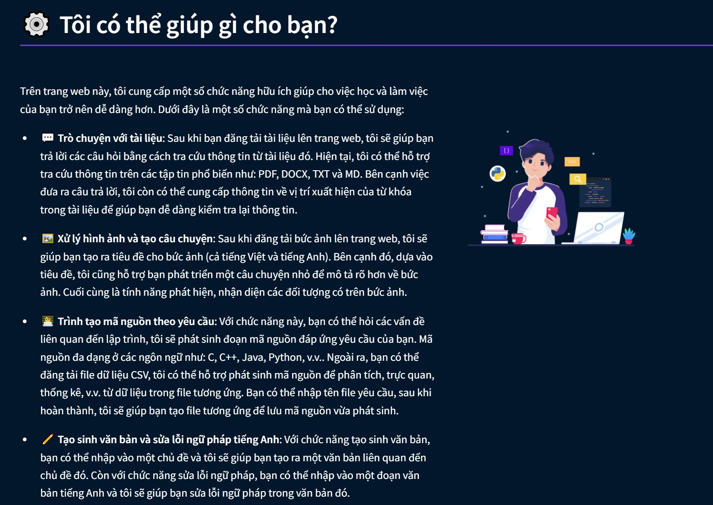

&emsp;Ngoài ra, để tăng thêm tính tương tác với người dùng, nhóm 8 đã tạo thêm một biểu mẫu (form) để người dùng có thể trình bày các nguyện vọng hay đề xuất của mình đến nhóm. Trong tương lai, các thành viên có thể dựa theo yêu cầu của người dùng để cải thiện và bổ sung thêm các chức năng khác.

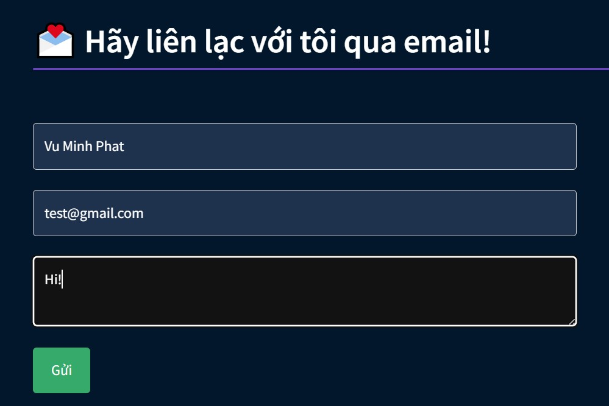

&emsp;Để xây dựng tính năng liên hệ thông qua email, nhóm 8 đã sử dụng FormSubmit. FormSubmit là một dịch vụ giúp ta tạo form liên hệ trực tuyến mà không cần sử dụng backend. Và đây cũng là dịch vụ được sử dụng khá phổ biến trong lĩnh vực lập trình Web.

&emsp;Khi người dùng đã điền đầy đủ thông tin cần thiết trong biểu mẫu và nhấn nút gửi thì sẽ có một email được gửi đến tài khoản của nhóm. Thông qua nội dung trong email, nhóm có thể đưa ra các chỉnh sửa cần thiết cho ứng dụng web của mình.

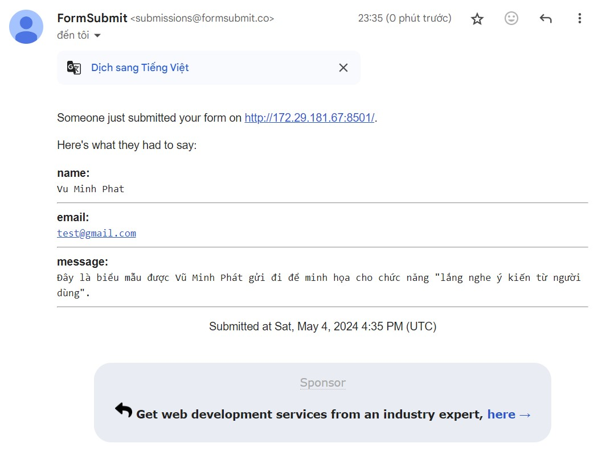

&emsp;Ở phần cuối cùng của trang Web là thông tin của từng thành viên trong nhóm 8 đã tham gia vào quá trình xây dựng và hoàn thiện đồ án cuối kỳ cho môn học "Nhập môn học máy".

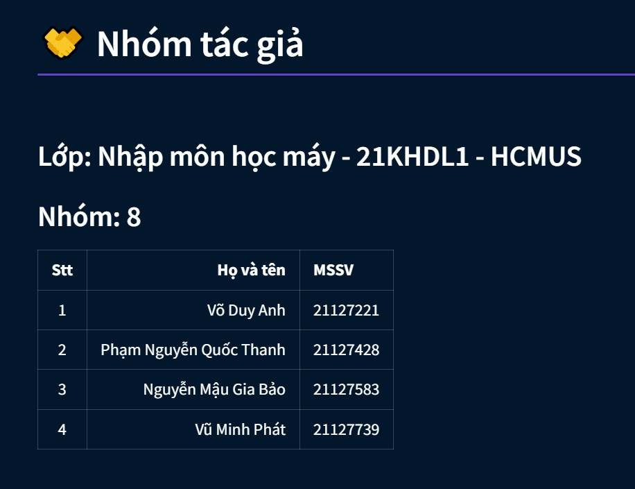

&emsp;Quan sát ở góc bên trái màn hình, ta sẽ thấy một "menu" cho phép người dùng chuyển đổi giữa các chức năng mà trang web cung cấp. Hiện tại, do chúng ta đang ở trang chủ nên lựa chọn "Trang chủ" đang được làm nổi bật. Khi nhấn vào một chức năng khác (với chức năng hiện tại), thì trình duyệt của người dùng sẽ được đưa đến chức năng tương ứng.

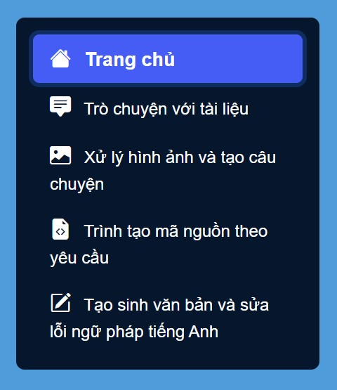

## 4.2. Trò chuyện với tài liệu

### 4.2.1. Giao diện và chức năng hoạt động

&emsp;Khi vừa truy cập đến chức năng "Trò chuyện với tài liệu", người dùng được yêu cầu đăng tải các file tài liệu của mình lên trang web. Hiện nay, trang web hỗ trợ tra cứu trên bốn loại tài liệu phổ biến là các file: PDF (\*.pdf), Word (\*.docx), Text (\*.txt) và Markdown (\*.md). Vì mỗi loại file sẽ có phương pháp đọc dữ liệu đặc thù để phù hợp với mục tiêu của chức năng. Nên, tạm thời, nhóm 8 chỉ cho phép người dùng đăng tải một trong bốn loại file nêu trên.

&emsp;Khi người dùng nhấn nút "Browse files", họ sẽ được phép đăng tải cùng lúc nhiều tập tin khác nhau. Tên của các file được người dùng lựa chọn sẽ xuất hiện ngay trên trang web để người dùng biết rằng liệu mình đã chọn đúng file hay chưa. Trong trường hợp người dùng chọn sai thì họ có thể gỡ file đó xuống bằng cách nhấn vào biểu tượng dấu "X" ở góc bên phải ứng với từng file.

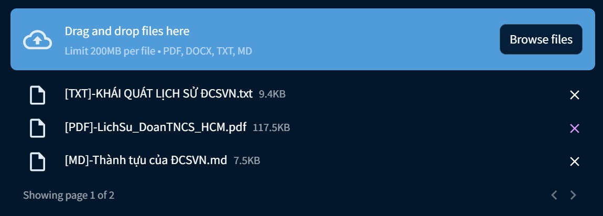

&emsp;Sau khi người dùng đã hoàn tất bước "đăng tải tài liệu", họ có thể chuyển ngay đến giai đoạn quan trọng nhất là "Hỏi thông tin từ tài liệu (của chính bản thân mình)". Giao diện của bước này được lấy cảm hứng từ các ứng dụng Chatbot phổ biến hiện nay như: ChatGPT, Gemini, Copilot, v.v..

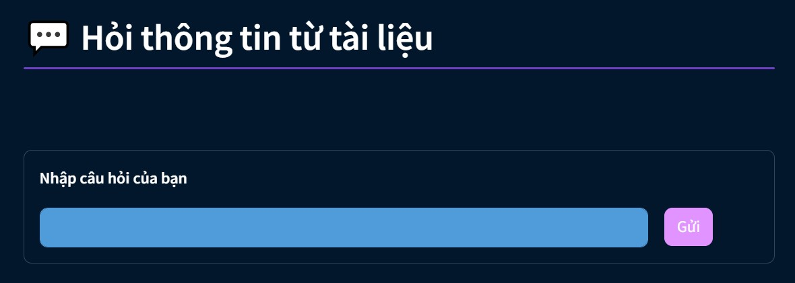

&emsp;Khi này, người dùng có thể bắt đầu trò chuyện với tài liệu của mình bằng cách đặt câu hỏi vào biểu mẫu chat bên dưới tiêu đề "Nhập câu hỏi của bạn" và nhấn nút "Gửi" để ứng dụng bắt đầu tra cứu tài liệu.

&emsp;Sau khi nút "Gửi" được nhấn thì câu hỏi của người dùng sẽ xuất hiện trên khung chat của hệ thống (ở phía bên phải) và trang web sẽ bắt đầu tra cứu thông tin từ tài liệu. Vì quá trình tra cứu có thể mất nhiều thời gian, đặc biệt là khi người dùng đăng tải nhiều file tài liệu với kích thước lớn. Do đó, để người dùng biết rằng trang web "vẫn còn hoạt động", thì ngay phía dưới biểu mẫu chat sẽ xuất hiện một "Spinner" xoay cho đến khi quá trình tra cứu đã hoàn tất.

&emsp;Khi quá trình tra cứu đã hoàn tất, mỗi tài liệu sẽ trả về một câu trả lời đi kèm với một giá trị điểm số cho biết "mức độ tin cậy" của câu trả lời từ tài liệu tương ứng. Các câu trả lời này sẽ trải qua một bước sàng lọc: các câu trả lời có điểm số thấp hơn một ngưỡng được định trước (là một siêu tham số) sẽ bị loại bỏ khỏi kết quả trả về. Sau đó, các câu trả lời trong kết quả trả về sẽ được sắp xếp theo thứ tự điểm số giảm dần. Điều này đồng nghĩa với việc các câu trả lời có "độ tin cậy" cao hơn sẽ được ưu tiên hơn. Bên cạnh đó, điều làm cho chức năng này trở nên nổi bật là việc kết quả trả về sẽ đi kèm với thông tin về số thứ tự của trang hoặc đoạn văn mà có xuất hiện câu trả lời này để người dùng có thể kiểm tra lại một lần nữa.

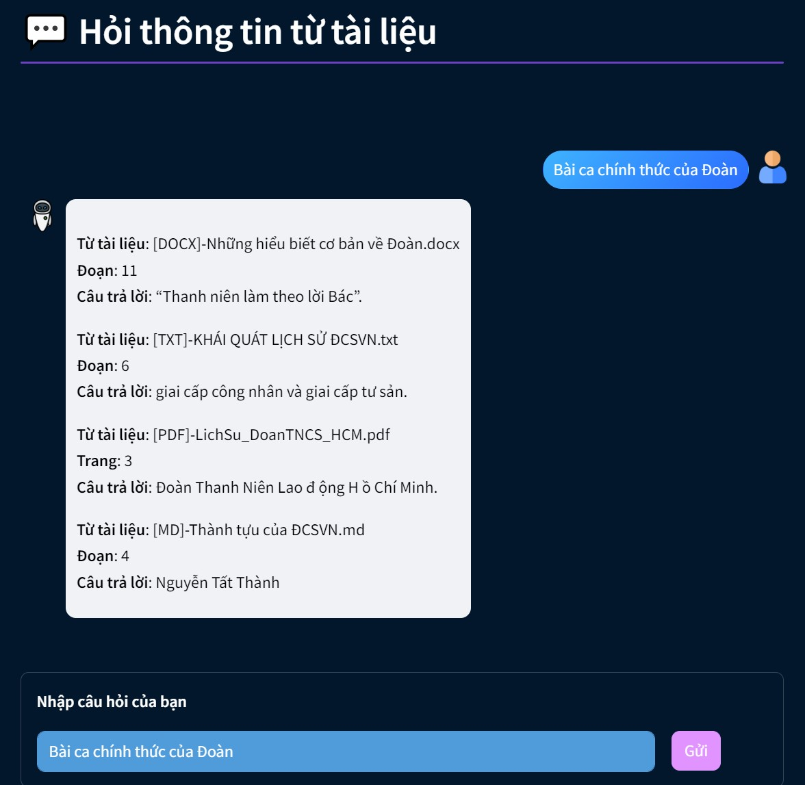

### 4.2.2. Tóm tắt quy trình hoạt động của chức năng

&emsp;Chức năng "Trò chuyện với tài liệu" đã sử dụng mô hình "XLM-RoBERTa (Large)" sau khi được fine-tune trên tập dữ liệu "Question Answering bằng tiếng Việt" để tra cứu tài liệu và trả về kết quả cho người dùng. Quy trình hoạt động của chức năng có thể được tóm tắt như sau:

- **Bước 1**: Sau khi người dùng đăng tải tài liệu, chương trình sẽ dựa vào loại tập tin để chọn ra cấu trúc dữ liệu phù hợp cho việc lưu trữ phía bên dưới.

- **Bước 2**: Chương trình nhận câu hỏi của người dùng thông qua giao diện website Streamlit.

- **Bước 3**: Với mỗi file tài liệu, chương trình thực hiện truy vấn thông qua API của Hugging Face để tìm câu trả lời phù hợp cho câu hỏi từ người dùng:

  - Nếu câu trả lời có điểm số thấp hơn ngưỡng đã đặt ra, thì chương trình bỏ qua câu trả lời này.
  - Ngược lại, chương trình sử dụng vị trí bắt đầu và kết thúc (index) của câu trả lời để tính ra vị trí tương ứng của câu trả lời trong tài liệu.

- **Bước 4**: Các câu trả lời hợp lệ sẽ được sắp xếp theo điểm số giảm dần trước khi kết quả được trả về cho người dùng.

### 4.2.3. Kiến trúc của mô hình

#### a. Giới thiệu về XLM và XLM-RoBERTa

&emsp;**XLM** (Cross-lingual Language Model) và **XLM-RoBERTa** đều là các mô hình ngôn ngữ đa ngôn ngữ được phát triển bởi Facebook AI. Chúng được thiết kế để hiểu và tạo văn bản bằng nhiều ngôn ngữ khác nhau, giải quyết những thách thức trong việc hiểu đa ngôn ngữ.

&emsp;**XLM** dựa trên kiến trúc của mô hình BERT (của Google AI) và học cách mã hóa thông tin đa ngôn ngữ bằng cách huấn luyện trên dữ liệu song ngữ, bao gồm các câu văn trong các ngôn ngữ khác nhau được căn chỉnh theo cấp độ của câu. XLM có thể thực hiện các tác vụ như dịch máy, phân loại đa ngôn ngữ và phân loại văn bản trên các ngôn ngữ khác nhau.

&emsp;**XLM-RoBERTa** là phiên bản cải tiến của XLM dựa trên kiến trúc RoBERTa. RoBERTa là một biến thể của BERT được tiền huấn luyện trên một tập dữ liệu lớn hơn và trong nhiều bước huấn luyện hơn, giúp tạo ra hiệu suất cao hơn trong các tác vụ xử lý ngôn ngữ tự nhiên. XLM-RoBERTa thừa hưởng khả năng xử lý đa ngôn ngữ của XLM đồng thời hưởng lợi từ khả năng học biểu diễn nâng cao của RoBERTa.

&emsp;Cả **XLM** và **XLM-RoBERTa** đều đã được sử dụng thành công trong nhiều ứng dụng xử lý ngôn ngữ tự nhiên, bao gồm dịch máy, phân loại đa ngôn ngữ, phân tích cảm xúc và phân loại văn bản.

#### b. Kiến trúc của mô hình XLM

&emsp;XLM sử dụng kiến trúc Transformer, một kiến trúc đã được chứng minh là hiệu quả trong nhiều tác vụ Xử lý Ngôn ngữ Tự nhiên (NLP). Nó mở rộng kiến trúc này để xử lý nhiều ngôn ngữ và học các biểu diễn đa ngôn ngữ.

&emsp;Các thành phần chính trong kiến trúc của XLM bao gồm:

1. **Transformer Encoder** (**Bộ mã hóa Transformer**): XLM sử dụng bộ mã hóa Transformer nhiều lớp, tương tự như BERT. Kiến trúc Transformer cho phép xử lý song song hiệu quả dữ liệu theo chuỗi và nắm bắt các "long-range dependency" (các phụ thuộc với khoảng cách xa) trong văn bản.

2. **Translation Language Modeling** (**Mô hình ngôn ngữ dịch**) (TLM): Trong quá trình tiền huấn luyện, XLM sử dụng một biến thể của MLM gọi là TLM. Trong quá trình này, các từ vựng từ các ngôn ngữ khác nhau được che lấp ngẫu nhiên trong một câu và mô hình được huấn luyện để dự đoán các từ bị che khuất đó. Điều này khuyến khích mô hình học cách biểu diễn ngữ cảnh không phụ thuộc vào ngôn ngữ, giúp mô hình hiểu nhiều ngôn ngữ một cách hiệu quả.

3. **Bilingual Objective** (**Mục tiêu song ngữ**): XLM giới thiệu một mục tiêu song ngữ, nơi dữ liệu song ngữ (câu trong hai ngôn ngữ có cùng nghĩa) được tận dụng trong quá trình huấn luyện. Điều này cho phép mô hình học các liên kết đa ngôn ngữ và chuyển kiến thức từ một ngôn ngữ sang ngôn ngữ khác.

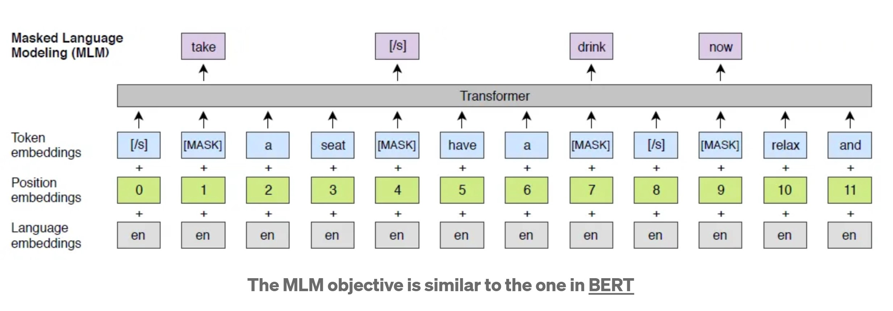
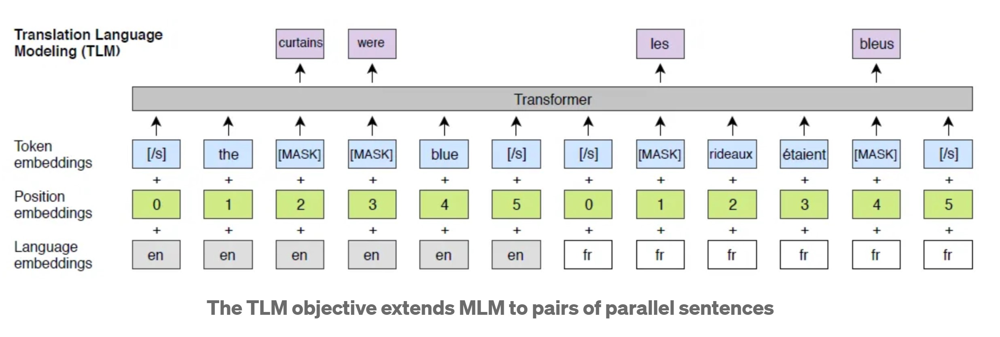

#### c. Kiến trúc của mô hình XLM-RoBERTa

&emsp;Mô hình **XLM-RoBERTa** là một sự mở rộng của XLM, sử dụng kiến trúc RoBERTa, một biến thể của mô hình Transformer, cho quá trình tiền huấn luyện. Nó bao gồm các lớp nhúng (embedding layer), bộ mã hóa Transformer và một cấu trúc hạ lưu (downstream structure). Sau đây, ta sẽ phân tích chi tiết về kiến trúc:

1. **Embedding Layers** (**Lớp nhúng**): Giống như các mô hình Transformer khác, XLM-RoBERTa bắt đầu với các lớp nhúng. Những lớp này ánh xạ các token đầu vào thành các vector, được gọi là nhúng từ (word embedding). XLM-RoBERTa sử dụng mã hóa cặp byte (BPE) để xử lý các đơn vị dưới từ (subword unit), cho phép nó xử lý các từ ngoài từ vựng và nắm bắt thông tin về hình thái học.

2. **Transformer Encoders** (**Bộ mã hóa Transformer**):

- Trái tim của kiến trúc XLM-RoBERTa là bộ mã hóa Transformer. Nó bao gồm nhiều lớp của cơ chế "self-attention" và mạng nơ-ron "feed-forward". Mỗi lớp trong bộ mã hóa xử lý chuỗi đầu vào song song, cho phép mô hình nắm bắt cả phụ thuộc cục bộ và toàn cục.
- Cơ chế "self-attention" cho phép mô hình chú ý đến các phần khác nhau của chuỗi đầu vào trong khi mã hóa thông tin ngữ cảnh. Nó tính toán trọng số chú ý (attention weights) cho từng token đầu vào, cho phép mô hình tập trung vào thông tin có liên quan trong quá trình mã hóa.
- Mạng nơ-ron feed-forward trong mỗi lớp Transformer giúp nắm bắt các mối quan hệ phức tạp và phi tuyến tính trong chuỗi đầu vào.

3. **Downstream Structure** (**Cấu trúc hạ lưu**): Đầu ra của bộ mã hóa Transformer được truyền qua một "downstream structure", có thể thay đổi tùy theo tác vụ cụ thể mà mô hình được huấn luyện. Cấu trúc này thường bao gồm các lớp bổ sung (ví dụ: các lớp liên kết đầy đủ (fully connected layers)) biến đổi các biểu diễn được mã hóa thành các đầu ra cụ thể cho từng tác vụ.

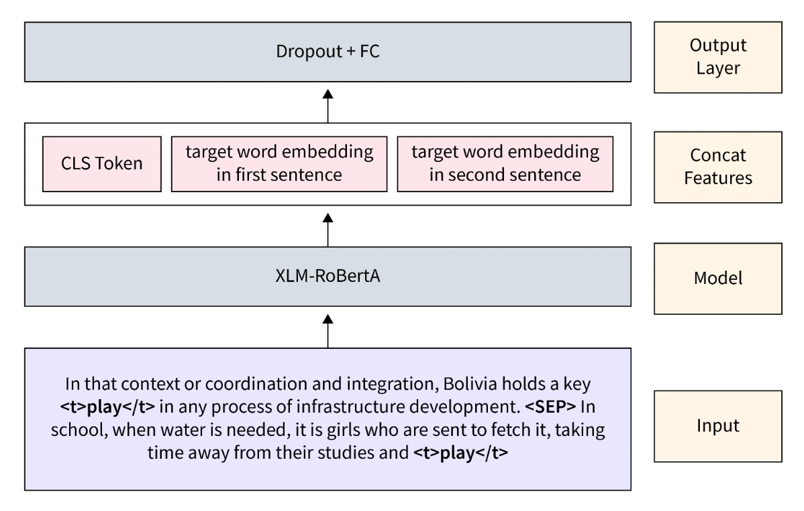

&emsp;Nhìn chung, kiến trúc của mô hình XLM-RoBERTa được thiết kế để học các biểu diễn câu mạnh mẽ có thể nắm bắt thông tin ngữ nghĩa và cú pháp trên các ngôn ngữ khác nhau. Bằng cách huấn luyện trên một lượng lớn dữ liệu đa ngôn ngữ, XLM-RoBERTa có thể tận dụng thông tin được chia sẻ giữa các ngôn ngữ để cải thiện hiệu suất trên các tác vụ đa ngôn ngữ khác nhau. Và đặc biệt hữu ích trong các tình huống yêu cầu hiểu biết đa ngôn ngữ và học tập chuyển giao (transfer learning).

### 4.2.4. Nhận xét về chức năng

#### a. Điểm mạnh:

- Thay vì sử dụng các hàm mặc định của thư viện Streamlit để xây dựng một Chatbot giúp tra cứu thông tin từ tài liệu. Nhóm 8 đã chủ động sử dụng CSS để tạo ra một giao diện đẹp và bắt mắt hơn cho trang web.

- Đồng thời, ta thấy trang web cũng trả về các kết quả khá chính xác với các yêu cầu từ người dùng. Điều này đã đáp ứng được mục tiêu mà cả nhóm đã đề ra ban đầu.

#### b. Hạn chế:

- Do mỗi loại tập tin khác nhau sẽ có cách thức đọc dữ liệu khác nhau nên hiện tại trang web mới chỉ hỗ trợ việc tra cứu trên bốn loại tập tin.

- Với các câu hỏi có cấu trúc phức tạp, thì ta thấy kết quả trả về chưa thực sự chính xác. Nhược điểm này thường xuất phát từ việc mô hình ta chọn có kích thước chưa đủ lớn để có thể tạo ra kết quả với độ chính xác tốt hơn. Tuy nhiên, việc sử dụng các mô hình lớn hơn thường phải đánh đổi bằng việc người dùng phải chờ đợi lâu hơn để có được câu trả lời. Đây là một bài toán khó mà nhóm 8 sẽ cần giải quyết trong tương lai.

## 4.3. Xử lý hình ảnh và tạo câu chuyện

### 4.3.1. Giao diện và chức năng hoạt động

&emsp;Giao diện khi người dùng vừa truy cập đến chức năng.
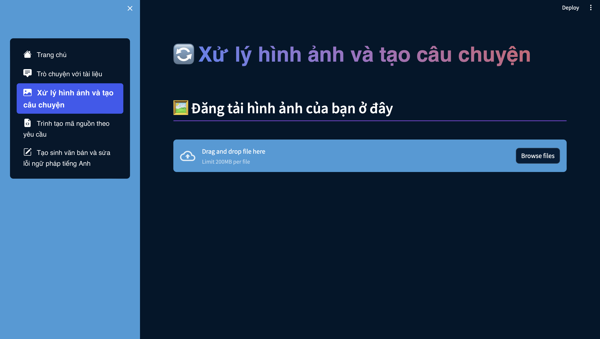

&emsp;Nhấn chọn "Browse files" để đăng tải hình ảnh bạn muốn xử lý. Sau khi hình ảnh đã được đăng tải lên sẽ có giao diện như sau:

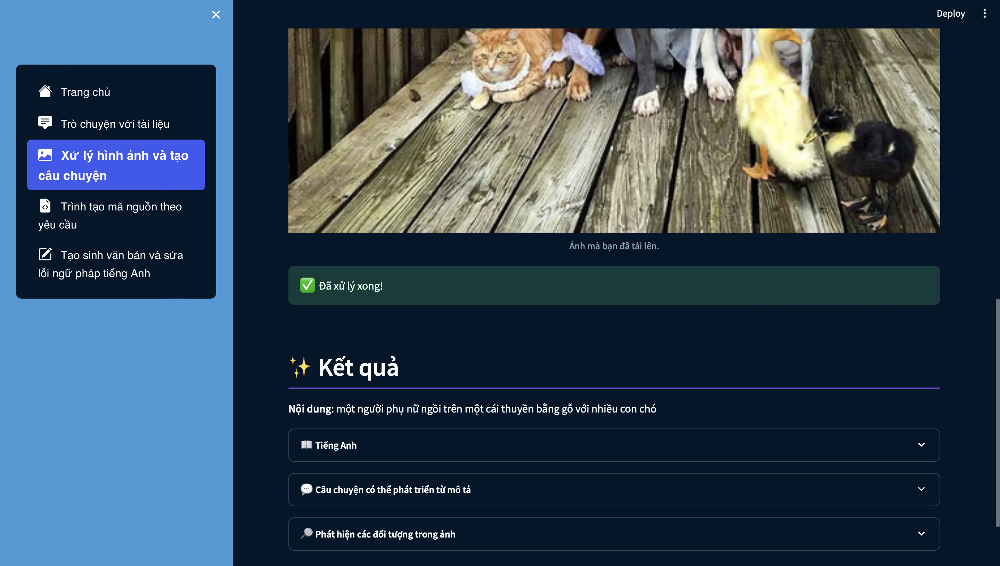

&emsp;Nội dung tóm tắt của hình ảnh sẽ được hiển thị ngay bên dưới hình ảnh. Đi cùng với đó là ba mục bạn có thể chọn để xem bao gồm: "Tiếng Anh", "Câu chuyện có thể phát triển từ mô tả", "Phát hiện các đối tượng trong ảnh".

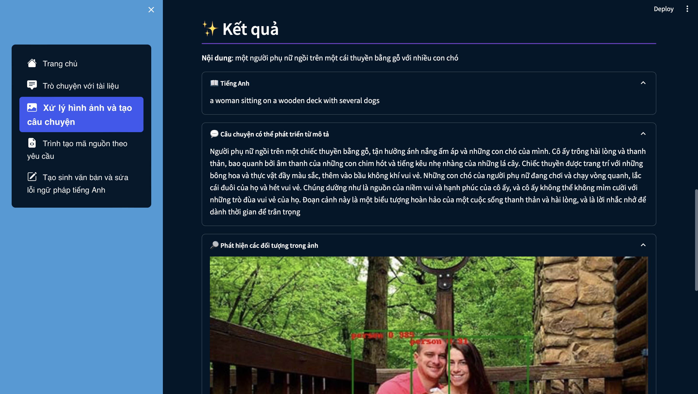

- Với mục "Tiếng Anh", bạn có thể xem mô tả của bức ảnh bằng tiếng Anh.
- Với mục "Câu chuyện có thể phát triển từ mô tả", bạn có thể xem một câu chuyện ngắn được phát triển từ đoạn mô tả bức ảnh để có thể hình dung tổng quát nội dung của bức ảnh.
- Với mục "Phát hiện các đối tượng trong ảnh", bạn có thể nhận biết được các đối tượng bên trong ảnh.

### 4.3.2. Tóm tắt quy trình hoạt động của chức năng

&emsp;Quy trình hoạt động của chức năng có thể tóm tắt như sau:

- **Bước 1**: Người dùng nhấn chọn "Browse files" để đăng tải hình ảnh muốn xử lý.
- **Bước 2**: Chương trình sẽ xử lý và gửi về kết quả là nội dung tóm tắt của hình ảnh. Đi cùng với đó là ba mục mà người dùng có thể chọn để xem, bao gồm: "Tiếng Anh", "Câu chuyện có thể phát triển từ mô tả" và "Phát hiện các đối tượng trong ảnh".

### 4.3.3. Kiến trúc của mô hình

#### a. Image-to-Text Model (Salesforce/blip-image-captioning-base):

- Sử dụng để chuyển đổi hình ảnh thành văn bản mô tả.
- Được sử dụng trong hàm "img2text(url)".

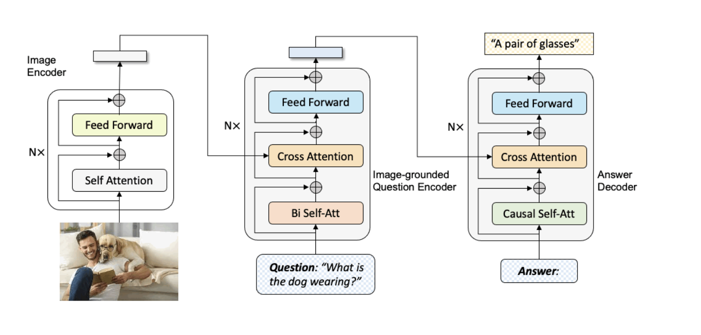

#### b. MBart Model (facebook/mbart-large-50-many-to-many-mmt):

- Một mô hình ngôn ngữ mạng transformer dựa trên kiến trúc BART (Bidirectional and Auto-Regressive Transformers).
- Được sử dụng để dịch từ văn bản tiếng Anh sang tiếng Việt.
- Được sử dụng trong hàm "translate_article_Eng_Viet(article_hi)" và "generate_story(scenario, llm)".

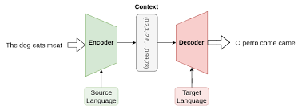

#### c. Detr Model (facebook/detr-resnet-50):

- Một mô hình dùng cho phát hiện đối tượng trong hình ảnh. Sử dụng mô hình DETR (DEtection TRansformer).
- Được sử dụng để phát hiện đối tượng trong hình ảnh và vẽ bounding boxes và nhãn tương ứng lên ảnh.
- Được sử dụng trong hàm "detect_objects_and_draw_bounding_boxes(url)".

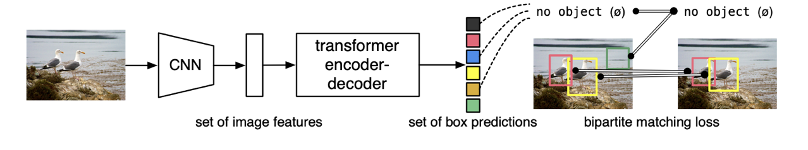

### 4.3.4. Nhận xét về chức năng

#### a. Điểm mạnh:

- Ứng dụng cho phép người dùng tải lên hình ảnh và tự động trích xuất văn bản từ hình ảnh đó.
- Giao diện người dùng thân thiện và dễ sử dụng, với các phần mở rộng giúp người dùng khám phá chi tiết kết quả.

#### b. Hạn chế:

- Vì các model không hỗ trợ tiếng Việt nên phải sử dụng thêm một model để có thể dịch từ tiếng Anh sang tiếng Việt. Điều này làm mất khá nhiều thời gian để xử lý và không hiệu quả.
- Câu chuyện được tạo ra từ mô tả còn nhiều hạn chế với những câu không được ý nghĩa.
- Phát hiện các đối tượng trong bức ảnh chỉ ở mức khá.

## 4.4. Trình tạo mã nguồn theo yêu cầu

### 4.4.1. Giao diện và chức năng hoạt động

&emsp;Người dùng sẽ nhập yêu cầu vào promt, sau đó ấn nút "Tạo code". Website sẽ phát sinh mã nguồn tương ứng với yêu cầu của người dùng. Ngoài ra, người dùng còn có thể điền tên file vào ô đầu tiên, hệ thống sẽ tạo một file chứa mã nguồn được phát sinh sau khi hoàn thành.

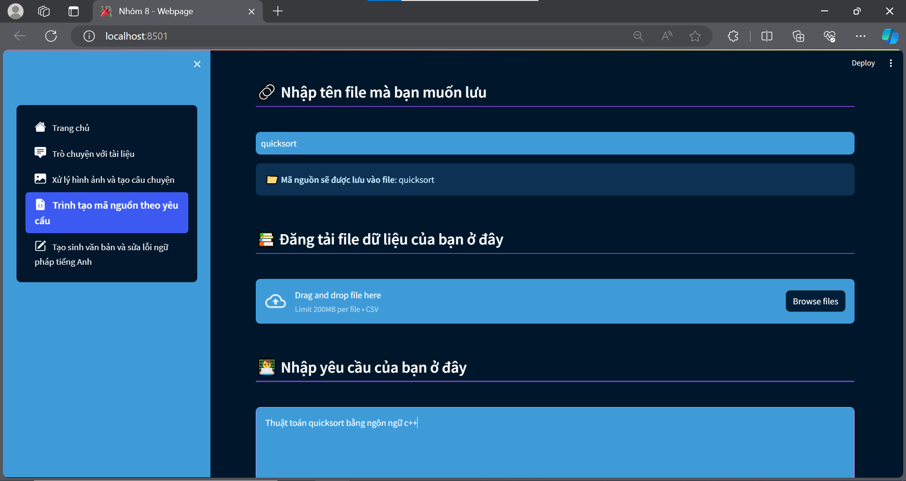

&emsp;Và đây là kết quả sau khi tạo code:

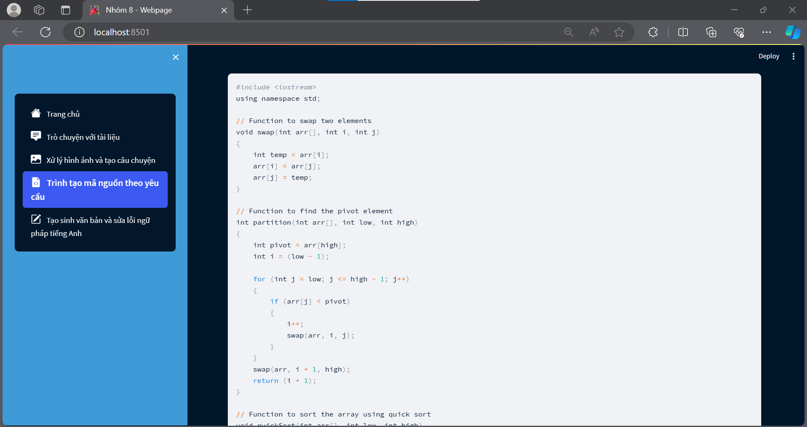

&emsp;Kết quả khi chạy thử code trên trình biên dịch:

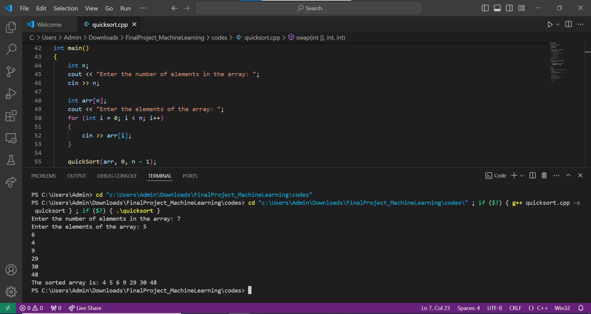

&emsp;Thêm vào đó, website còn có khả năng hỗ trợ lập trình, phân tích các file dữ liệu CSV của người dùng. Khi muốn lập trình tương tác với file CSV, người dùng chọn "Browse files", chọn file tương ứng. Sau đó nhập yêu cầu mong muốn và chọn "Tạo code".

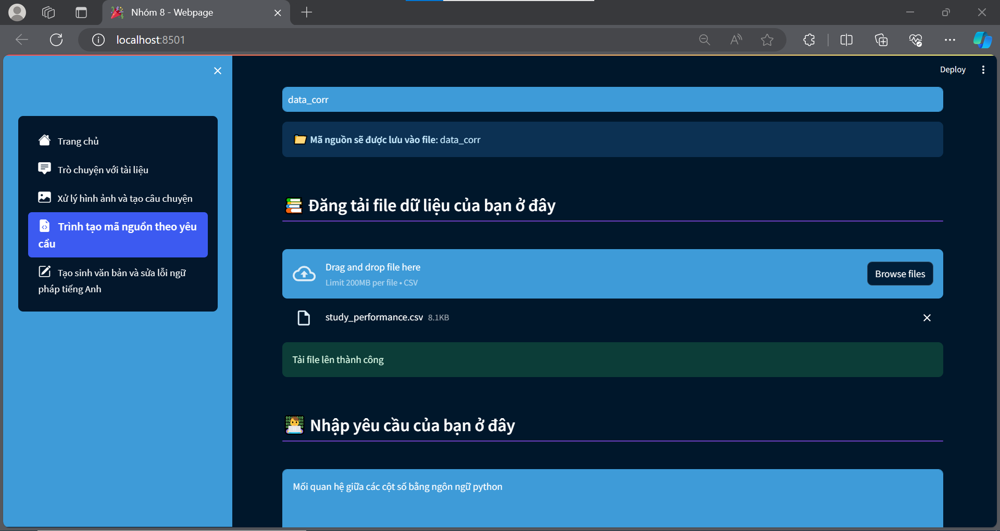

&emsp;Kết quả sau khi tạo code:

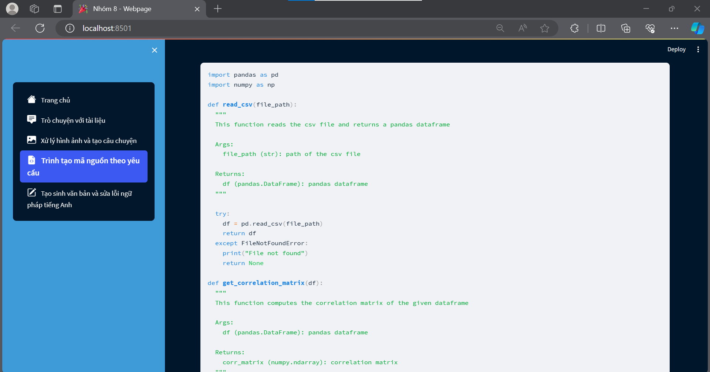

&emsp;Kết quả khi chạy thử code trên trình biên dịch:

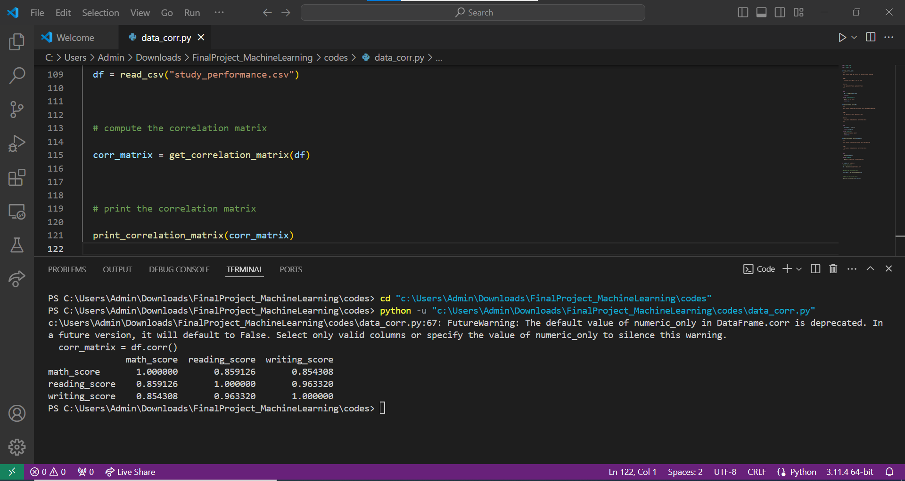

&emsp;Sau khi hoàn thành, các file chứa những mã nguồn vừa được phát sinh sẽ được lưu trữ trong thư mục "codes".

### 4.4.2. Tóm tắt quy trình hoạt động của chức năng

&emsp;Chương trình sử dụng Gemini API để phát sinh mã code theo yêu cầu người dùng. Chương trình hoạt động với cơ chế sau:

- **Bước 1**: Nhận và đọc yêu cầu người dùng giao diện Streamlit.
- **Bước 2**: Gửi yêu cầu và các tham số đến API Gemini.
- **Bước 3**: Nhận kết quả và hiển thị cho người dùng.

### 4.4.3. Kiến trúc của mô hình

&emsp;Gemini (Google Bard) là một Chatbot trí tuệ nhân tạo được phát triển bởi Google AI, ựa trên mô hình ngôn ngữ lớn. Nó được xây dựng dựa trên kiến trúc mạng nơ-ron nhân tạo Transformer, kiến trúc này là tiêu chuẩn cho các mô hình ngôn ngữ và được sử dụng trong nhiều ứng dụng khác nhau, bao gồm dịch máy, tóm tắt văn bản, và trả lời câu hỏi.

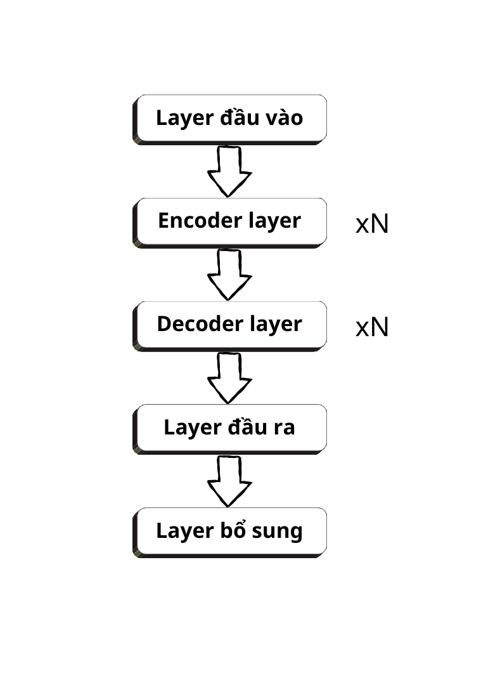

1. **Layer đầu vào**:

- Nhận dữ liệu đầu vào là các đoạn văn gồm yêu cầu của người dùng và dữ liệu từ file CSV nếu có từ API Gemini.
- Sử dụng kỹ thuật word embedding để chuyển đổi văn bản thành dạng vector, trong đó mỗi từ được biểu diễn bởi một vector tương ứng.
- Layer Positional Encoding: Thêm thông tin về vị trí của các từ trong câu để mô hình có thể hiểu được trật tự của các từ và ngữ cảnh của câu.

2. **Encoder layer**:

- Gồm nhiều Encoder Layer được xếp chồng lên nhau, mỗi layer có thể lặp lại nhiều lần.
- Mỗi Encoder Layer bao gồm:
  - Self-attention: Cho phép mô hình tập trung vào các phần quan trọng của văn bản đầu vào bằng cách tính toán mức độ liên quan giữa các từ trong câu.
  - Multi-head attention: Sử dụng nhiều head attention để mô hình có thể tập trung vào nhiều khía cạnh khác nhau của văn bản.
  - Feed-forward network: Xử lý thông tin chi tiết hơn bằng cách áp dụng một mạng nơ-ron feed-forward lên vector biểu diễn của văn bản.
  - Residual connection: Kết nối vector đầu vào của layer với vector đầu ra của layer để giúp mô hình học được tốt hơn.
  - Layer Normalization: Giúp ổn định quá trình học tập bằng cách chuẩn hóa vector đầu ra của layer.

3. **Decoder layer**:

- Tương tự như Encoder layer, nhưng thay vì tạo ra vector biểu diễn cho văn bản, nó tạo ra văn bản mới.
- Gồm nhiều Decoder Layer được xếp chồng lên nhau, mỗi layer có thể lặp lại nhiều lần.
- Mỗi Decoder Layer bao gồm:
  - Masked self-attention: Tương tự như self-attention trong Encoder, nhưng chỉ tập trung vào các phần văn bản đã được tạo ra trước đó để tránh lặp lại.
  - Encoder-decoder attention: Cho phép mô hình tập trung vào vector biểu diễn được tạo ra bởi Encoder để đảm bảo văn bản được tạo ra có liên quan đến văn bản đầu vào.
  - Các thành phần còn lại giống như Encoder layer nhưng dùng để điều chỉnh kết quả đầu ra của mô hình.

4. **Layer đầu ra**:

- Chuyển đổi vector biểu diễn được tạo ra bởi Decoder thành văn bản hoặc lời nói.
- Sử dụng kỹ thuật word embedding ngược lại để ánh xạ vector biểu diễn của mỗi từ sang từ tương ứng trong ngôn ngữ tự nhiên.

5. **Layer bổ sung**:

- Layer Beam Search: Giúp mô hình tìm ra chuỗi văn bản có khả năng cao nhất thay vì chỉ tạo ra một chuỗi duy nhất.
- Layer Length Penalty: Giúp mô hình tạo ra văn bản có độ dài phù hợp với ngữ cảnh.
- Layer Temperature: Điều chỉnh mức độ sáng tạo của văn bản được tạo ra.

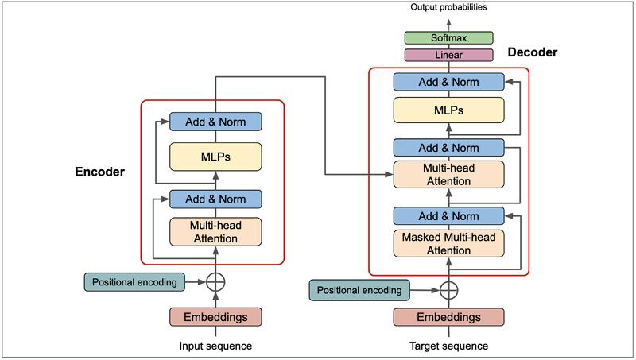

### 4.4.4. Nhận xét về chức năng

#### a. Điểm mạnh:

- Hiệu quả: xử lý thông tin hiệu quả hơn bằng cách chia nhỏ nhiệm vụ thành các bước nhỏ hơn và thực hiện song song các bước này trong các layer.

- Khả năng học tập: Kiến trúc layer giúp Gemini học được các biểu diễn phức tạp hơn của văn bản và thực hiện các nhiệm vụ NLP một cách hiệu quả hơn.

#### b. Hạn chế:

- Do chương trình phải sử dụng API của Gemini nên sẽ bị một hạn chế lớn đó là chỉ có thể nhập vào 10000 ký tự, bao gồm cả dữ liệu trong file CSV.

- Ngoài ra, đối với các yêu cầu lập trình phức tạp, chương trình sẽ không thế đưa ra mã nguồn hoàn chỉnh hoặc có độ chính xác không đảm bảo.

## 4.5. Tạo sinh văn bản và sửa lỗi ngữ pháp tiếng Anh

### 4.5.1. Giao diện và chức năng hoạt động

#### a. Chức năng "Tạo sinh văn bản"

&emsp;Giao diện khi người dùng vừa truy cập đến chức năng "Tạo sinh văn bản".
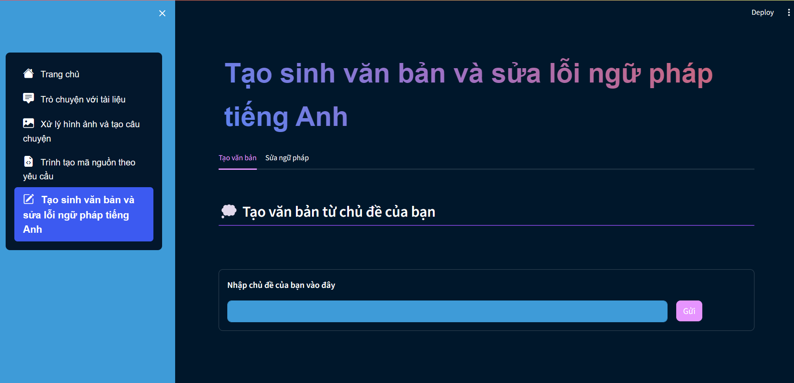

&emsp;Khi này, người dùng có thể chọn một chủ đề bất kỳ và nhập vào biểu mẫu chat va nhấn nút "Gửi". Trong lúc mà trang web đang sinh ra văn bản thì sẽ có một "Spinner" xoay bên dưới để báo hiệu cho người dùng biết rằng trang web vẫn đang hoạt động.

&emsp;Ngay khi kết quả được mô hình trả về, trang web sẽ hiển thị đoạn văn bản lên khung chat cho người dùng dễ theo dõi. Vẫn giữ nguyên ý tưởng ban đầu của đồ án là xây dựng một trang web chủ yếu phục vụ cho người Việt Nam, nên kết quả về mặc định luôn là tiếng Việt.

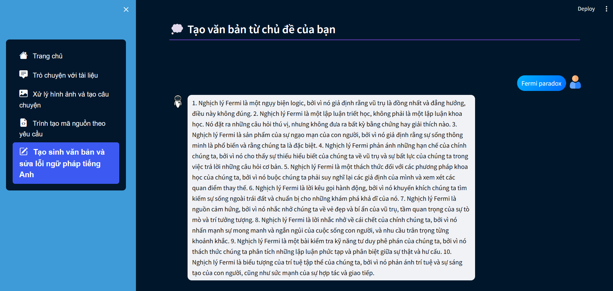

#### b. Chức năng "Sửa lỗi ngữ pháp"

&emsp;Giao diện khi người dùng vừa truy cập đến chức năng "Sửa lỗi ngữ pháp".
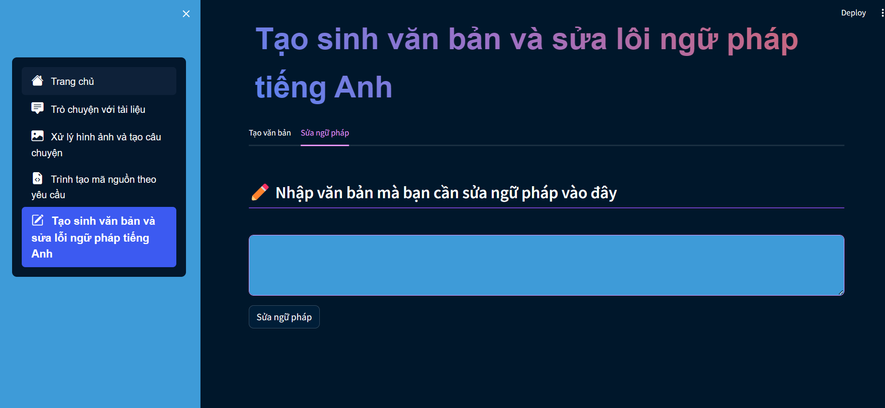

&emsp;Khi này, người dùng có thể nhập vào một văn bản tiếng Anh bất kỳ (có thể đúng hoặc sai ngữ pháp) vào khung bên dưới và nhấn nút "Sửa ngữ pháp". Trong lúc mô hình học máy được nhúng bên dưới chương trình đang hoạt động thì trang web sẽ hiện thị một "Spinner" xoay bên dưới để báo hiệu cho người dùng biết rằng trang web vẫn đang hoạt động.

&emsp;Ngay khi kết quả được mô hình trả về, website Streamlit sẽ đóng vai trò như một người vận chuyển giúp đưa kết quả đến với người dùng. Kết quả trả về sẽ là một đoạn văn bản tiếng Anh hoàn toàn đúng ngữ pháp và người dùng có thể yêu tâm để sử dụng đoạn văn này vào các công việc của mình, chẳng hạn như: soạn nội dung, viết báo cáo, v.v..

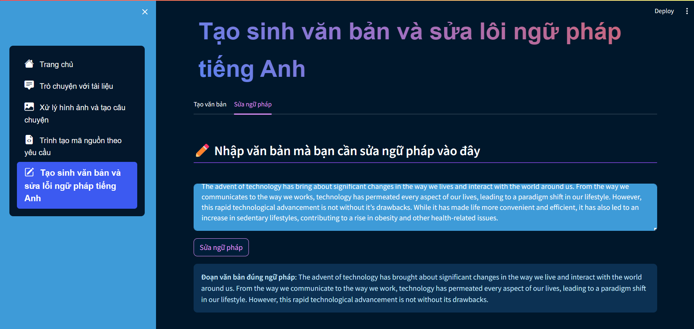

### 4.5.2. Tóm tắt quy trình hoạt động của chức năng

#### a. Chức năng "Tạo sinh văn bản"

- **Bước 1**: Chương trình nhận "chủ đề" từ người dùng thông qua giao diện website Streamlit.
- **Bước 2**: Khi nút "Gửi" được kích hoạt, chương trình sẽ sử dụng API của mô hình "Zephyr" để sinh ra một đoạn văn bản dựa trên chủ đề được nhập vào.
- **Bước 3**: Tuy nhiên, kết quả từ bước 2 hiện đang được viết bằng tiếng Anh (chưa thể gọi là thân thiện với người Việt). Khi này, ta cần nhờ đến sự hỗ trợ của một mô hình học máy khác là "envit5-translation" để dịch đoạn văn sang tiếng Việt.
- **Bước 4**: Sau khi hoàn tất bước 3, website Streamlit sẽ nhận kết quả cuối cùng và hiển thị cho người dùng dưới dạng một đoạn hội thoại. Giao diện này được lấy cảm hứng từ các ứng dụng Chatbot phổ biến hiện nay.

#### b. Chức năng "Sửa lỗi ngữ pháp"

- **Bước 1**: Chương trình nhận "đoạn văn tiếng Anh" từ người dùng thông qua giao diện website Streamlit.
- **Bước 2**: Khi nút "Sửa ngữ pháp" được nhấn, chương trình sẽ sử dụng API của mô hình "vennify/t5-base-grammar-correction" để sửa các lỗi ngữ pháp (nếu có) trong đoạn văn mà người dùng nhập vào.
- **Bước 3**: Sau khi hoàn tất bước 2, website Streamlit sẽ nhận kết quả cuối cùng và hiển thị cho người dùng ngay trên chính giao diện của trang web.

### 4.5.3. Kiến trúc của mô hình

Zephyr là một mô hình được fine-tuned từ mô hình Mistral. Đây là một mô hình decoder-only Transformer với 2 điểm chính sau:

- Grouped-Query Attention cho phép gom nhóm các query lại với nhau trước khi tính attention.
- Sliding Window Attention.

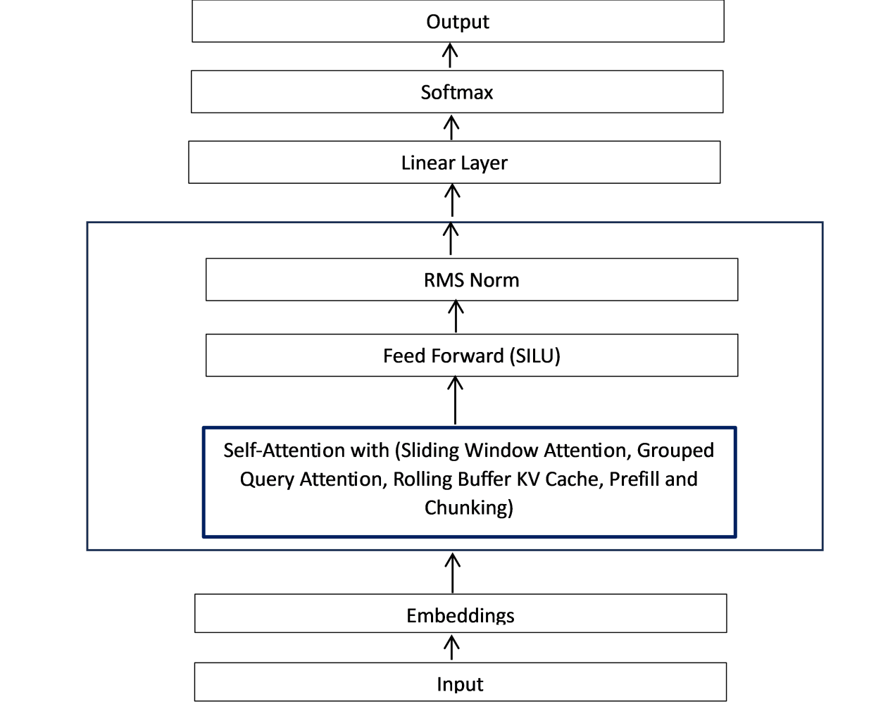

### 4.5.4. Nhận xét về chức năng

#### a. Điểm mạnh:

- Nhìn chung, hai tác vụ có trong chức năng này đều hoạt động rất tốt trong hầu hết trường hợp được cả nhóm thử nghiệm. Điều này cho thấy cả nhóm đã lựa chọn được các mô hình đủ tốt để giúp trang web thực hiện các chức năng như trong mô tả ban đầu.

- Bên cạnh đó, giao diện trang web cũng được các thành viên đầu tư công sức, chỉnh sửa để tạo một giao diện bắt mắt và trải nghiệm sử dụng thoải mái dành cho người dùng. Việc sử dụng HTML và CSS trong quá trình xây dựng Chatbot giúp mang lại nhiều trải nghiệm thú vị so với khi chỉ sử dụng các "thành phần" được cung cấp sẵn bởi Streamlit.

#### b. Hạn chế:

&emsp;Đối với chức năng "Sửa lỗi ngữ pháp": Đôi khi mô hình sẽ không thể sửa được hết tất cả các câu trong một đoạn văn bản (trong trường hợp người dùng nhập vào một đoạn văn bản quá dài).

- **Giải pháp**: Khi này, ta có thể tiền xử lý dữ liệu bằng cách tách một đoạn văn lớn thành các đoạn văn nhỏ hơn sao cho ngữ cảnh của mỗi câu văn không bị "sai lệch". Sau đó, ta gọi API từ mô hình để sữa lỗi trên từng đoạn văn nhỏ. Cuối cùng ta tổng hợp kết quả và trả đoạn văn hoàn toàn đúng ngữ pháp về cho người dùng.

# 5. Tổng kết đồ án

## 5.1. Lý thuyết

&emsp;Trong quá trình xây dựng hệ thống "Trợ lý ảo Pratt", các thành viên trong nhóm 8 đã được học thêm những lý thuyết về quá trình phát triển phần mềm và các kiến thức liên quan đến ngành khoa học về web.

&emsp;Qua đồ án, các thành viên đã có cơ hội nghiên cứu và thực nghiệm để tạo các giao diện Web đẹp mắt, tạo các hành vi tương tác giữa người dùng với giao diện web. Quá trình này cũng giúp các thành viên rèn luyện thói quen không ngại học hỏi các công nghệ mới và nuôi dưỡng thêm niềm đam mê với ngành lập trình. Đó là những trải nghiệm hết sức quý giá trong quá trình xây dựng hệ thống hiện tại.

## 5.2. Khó khăn

&emsp;Một trong những khó khăn lớn nhất mà cả nhóm gặp phải trong quá trình hoàn thiện đồ án lần này nằm ở việc tìm cách để sử dụng các framework hỗ trợ việc gọi API từ Hugging Face mà tiêu biểu là LangChain. LangChain có thể được xem là một framework còn khá non trẻ, tuy mạnh mẽ nhưng vẫn cần được cập nhật liên tục để cải thiện hiệu suất của hệ thống. Điều này vô hình trung lại làm cho các đoạn code được các lập trình viên chia sẻ cho nhau trên các diễn đàn phổ biến như StackOverflow trở nên "lỗi thời" nhanh chóng chỉ sau vài thàng.

&emsp;Đây là một khó khăn rất lớn mà nhóm 8 phải thường xuyên đối mặt trong lúc lập trình hệ thống. Điều này buộc các thành viên phải dành nhiều thời gian hơn để tra cứu tài liệu: từ phần bình luận trên các diễn đàn phổ biến đến việc phải tự đọc tài liệu từ trang web chính thức của framework.

&emsp;Tuy nhiên, sau nhiều nỗ lực thì cuối cùng nhóm 8 cũng đã tìm ra hướng đi phù hợp và hoàn thiện một trang web có tích hợp công nghệ AI cho đồ án cuối kỳ như hiện tại.

## 5.3. Đánh giá về kết quả đạt được

&emsp;Như vậy, nhóm 8 đã xây dựng thành công một ứng dụng website có tích hợp các công nghệ AI tiên tiến để giúp người dùng xử lý các tác vụ phổ biến trong công việc và học tập. Tuy vẫn còn một vài hạn chế nhất định nhưng nhìn chung sản phẩm "Trợ lý ảo Pratt" vẫn đáp ứng được các mục tiêu mà cả nhóm đã đề ra cũng như các yêu cầu từ đồ án cuối kỳ. Qua đồ án lần này, các thành viên trong nhóm 8 đã có cơ hội được nghiên cứu và vận dụng các kiến thức về "Học máy" để xây dựng một sản phẩm hoàn chỉnh. Đây sẽ là bước đệm để cho các bạn sinh viên có niềm đam mê với AI có thể tiếp tục nuôi dưỡng và theo đuổi ước mơ.

## 5.4. Kế hoạch phát triển sản phẩm trong tương lai

&emsp;Trong tương lai, dựa trên những ý kiến phản hồi từ người dùng và nhu cầu của xã hội, sản phẩm "Trợ lý ảo Pratt" có thể được tiếp tục phát triển và mở rộng để vừa nâng cao chất lượng của các chức năng sẵn có, vừa cung cấp cho người dùng nhiều chức năng hữu ích hơn nữa. Nhóm phát triển tin tưởng rằng "Trợ lý ảo Pratt" có tiềm năng trở thành một công cụ hỗ trợ đắc lực cho người dùng trong nhiều lĩnh vực của cuộc sống để góp phần xây dựng một tương lai thông minh và tiện lợi hơn.

# 6. Tài liệu tham khảo

[1]: Build a Website in only 12 minutes using Python & Streamlit - [yt.com/CodingIsFun](https://www.youtube.com/watch?v=VqgUkExPvLY).  
[2]: Create Multi Pages websites using Streamlit | Python - [yt.com/beginnerscodezone](https://www.youtube.com/watch?v=GvRfFdymaFA&t=307s).  
[3]: MiAI_Langchain_RAG - [github.com/thangnch](https://github.com/thangnch/MiAI_Langchain_RAG/tree/main).  
[4]: Langchain Ask PDF (Tutorial) - [github.com/alejandro-ao](https://github.com/alejandro-ao/langchain-ask-pdf/tree/main).  
[5]: Kickstart your Custom Streamlit Chatbot (ft. CSS & Langchain) - [yt.com/andfanilo](https://www.youtube.com/watch?v=6fs80o7Xm4I).  
[6]: XLM and XLM-RoBERTa - [scaler.com](https://www.scaler.com/topics/nlp/xlm-roberta/)  
[7]: Hiểu hơn về BERT: Bước nhảy lớn của Google - [viblo.asia](https://viblo.asia/p/hieu-hon-ve-bert-buoc-nhay-lon-cua-google-eW65GANOZDO).
[8]: XLM-RoBERTa large for QA on Vietnamese languages (also support various languages) - [huggingface.co/ancs21](https://huggingface.co/ancs21/xlm-roberta-large-vi-qa).  
[9]: XLM-RoBERTa - [huggingface.co/docs](https://huggingface.co/docs/transformers/model_doc/xlm-roberta).  
[10]: Khái Quát Về Trí Tuệ Nhân Tạo, Lịch Sử Hình Thành và Ứng Dụng - [viblo.asia](https://viblo.asia/p/tri-tue-nhan-tao-khai-quat-ve-tri-tue-nhan-tao-lich-su-hinh-thanh-va-ung-dung-bXP4WADDL7G).  
[11]: mBART-50 many to many multilingual machine translation - [huggingface.co](https://huggingface.co/facebook/mbart-large-50-many-to-many-mmt).  
[12]: MBart and MBart-50 - [huggingface.co](https://huggingface.co/docs/transformers/model_doc/mbart).  
[13]: Fine-tuning mBART to unseen languages - [medium.com/pablo_rf](https://medium.com/@pablo_rf/fine-tuning-mbart-to-unseen-languages-c2fd55388ac5).  
[14]: How to create Image to Text AI application - [yt.com/rajkkapadia](https://www.youtube.com/watch?v=Jri_J19E1Ec).  
[15]: How to Make Your Images Talk: The AI that Captions Any Image - [yt.com/PritishMishra](https://www.youtube.com/watch?v=aaP7JJZuvGs).  
[16]: BLIP: Bootstrapping Language-Image Pre-training for Unified Vision-Language Understanding and Generation - [huggingface.co](https:///Salesforce/blip-image-captioning-base).  
[17]: How to Use Salesforce - Blip Image Captioning Model - [yt.com/fahdmirza](https://www.youtube.com/watch?v=Yfsg_7FCw3Q).  
[18]: Falcon-7B-Instruct - [huggingface.co](https://huggingface.co/tiiuae/falcon-7b-instruct).  
[19]: Falcon-7B-Instruct LLM with LangChain Tutorial - [yt.com/1littlecoder](https://www.youtube.com/watch?v=mAoNANPOsd0).  
[20]: tiiuae-falcon-7b-instruct - [clarifai.com](https://clarifai.com/clarifai/LLM-OpenSource-Models-Training-Inference-Test/models/tiiuae-falcon-7b-instruct).
[21]: DETR (End-to-End Object Detection) model with ResNet-50 backbone - [huggingface.co](https://huggingface.co/facebook/detr-resnet-50).  
[22]: Review — DETR: End-to-End Object Detection with Transformers - [sh-tsang.medium.com](https://sh-tsang.medium.com/review-detr-end-to-end-object-detection-with-transformers-c64977be4b8e).  
[23]: Object detection Using Detection Transformer (Detr) on custom dataset - [yt.com/CodeWithAarohi](https://www.youtube.com/watch?v=xuh37qziXnw).  
[24]: Gemini-Coder - [github.com](https://github.com/haseeb-heaven/gemini-interpreter).  
[25]: T5 Grammar Correction - [huggingface.co](https://huggingface.co/vennify/t5-base-grammar-correction).  
[26]: Grammer Correction using T5-Transformer - [kaggle.com](https://www.kaggle.com/code/meetnagadia/grammer-correction-using-t5-transformer).  
[27]: Understanding T5 Model : Text to Text Transfer Transformer Model - [towardsdatascience.com](https://towardsdatascience.com/understanding-t5-model-text-to-text-transfer-transformer-model-69ce4c165023).  
[28]: Model Card for Zephyr 7B β - [huggingface.co](https://huggingface.co/HuggingFaceH4/zephyr-7b-beta).  
[29]: EnViT5 Translation - [huggingface.co](https://huggingface.co/VietAI/envit5-translation).  
[30]: MTet: Multi-domain Translation for English-Vietnamese - [github.com/vietai](https://github.com/vietai/mTet).
