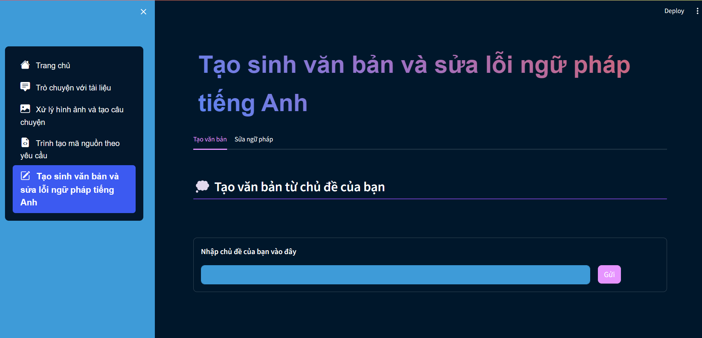
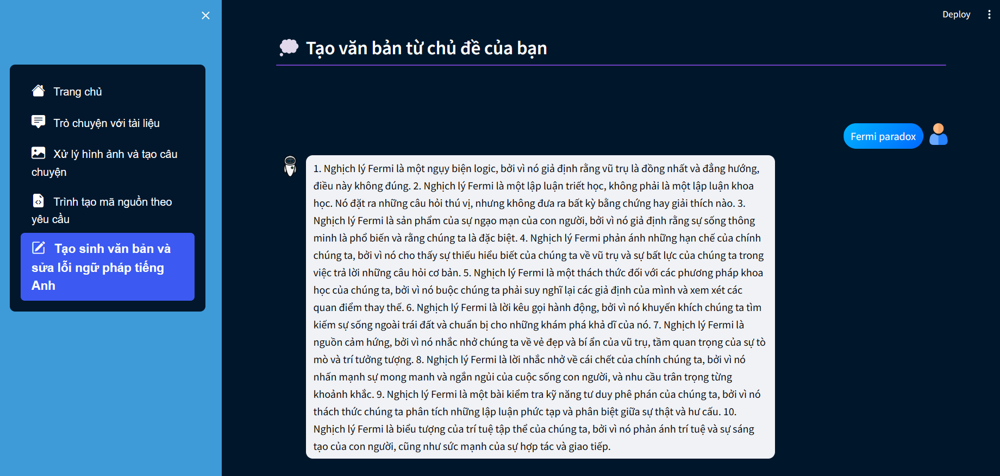
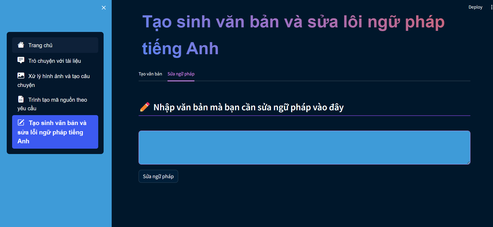
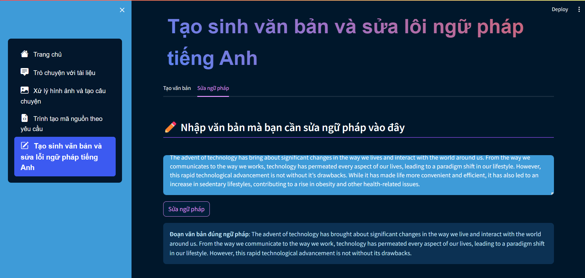
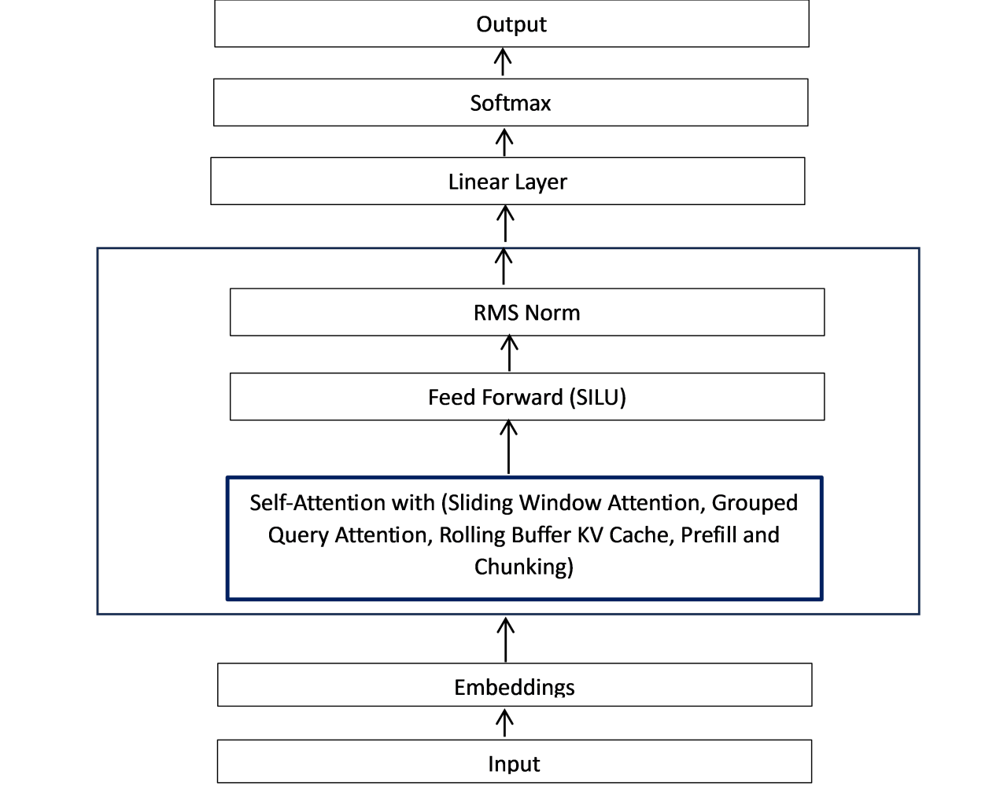

# FinalProject_MachineLearning

- Tên chức năng: Tạo sinh văn bản và sửa lỗi ngữ pháp tiếng Anh
    - Mô tả chức năng: 
	    + Tạo sinh văn bản: Cho một chủ đề và mô hình sẽ cho ra 1 văn bản liên quan tới chủ đề đấy.
	    + Sửa lỗi ngữ pháp: Cho một câu tiếng Anh sai ngữ pháp và mô hình sẽ sửa lỗi.
    - Tên file chạy chức năng: writing_correction.py

# Report

## Giao diện và chức năng hoạt động

### Tạo sinh văn bản

- Cho một chủ đề để mô hình tạo sinh

- Văn bản sẽ được tự động dịch sang tiếng Việt

### Sửa lỗi ngữ pháp

- Cho một đoạn văn hoặc một câu tiếng Anh sai ngữ pháp và mô hình sẽ tự động sửa lỗi.

## Tóm tắt quy trình hoạt động của chức năng
### Tạo sinh văn bản
- Mô hình sẽ sinh văn bản dựa trên chủ đề được nhập vào, sử dụng mô hình Zephyr.
- Văn bản sẽ được tự động dịch sang tiếng Việt bằng mô hình envit5 translation.

### Sửa lỗi ngữ pháp
- Mô hình sẽ sửa lỗi ngữ pháp dựa trên văn bản được nhập vào, sử dụng mô hình vennify/t5-base-grammar-correction để sửa các lỗi ngữ pháp.

## Kiến trúc của mô hình
### Tạo sinh văn bản

- Zephyr là một mô hình được fine-tuned từ mô hình Mistral.
- Đây là một mô hình decoder-only Transformer với 2 điểm chính sau:
  - Grouped-Query Attention cho phép gom nhóm các query lại với nhau trước khi tính attention.
  - Sliding Window Attention 

## Hạn chế
### Sửa lỗi ngữ pháp
- Đôi khi mô hình sẽ không thể sửa được hết tất cả các câu trong 1 đoạn văn bản -> Giải pháp: Nên tách thành các đoạn nhỏ.
