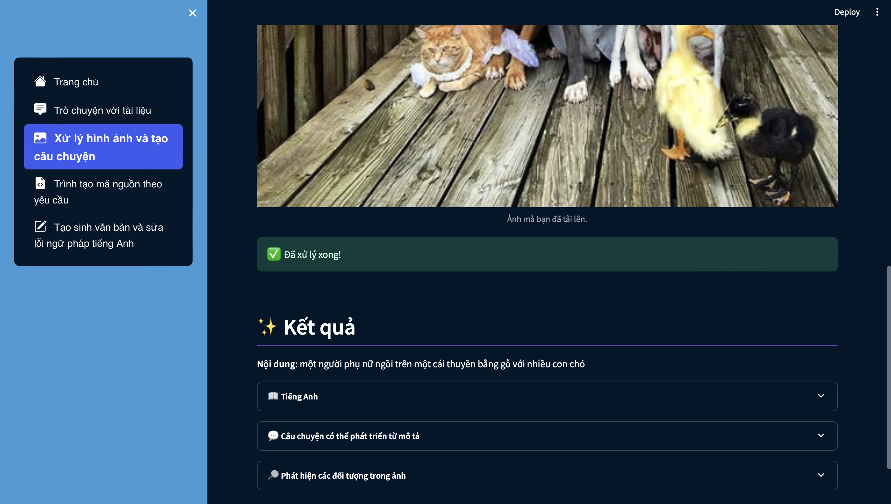
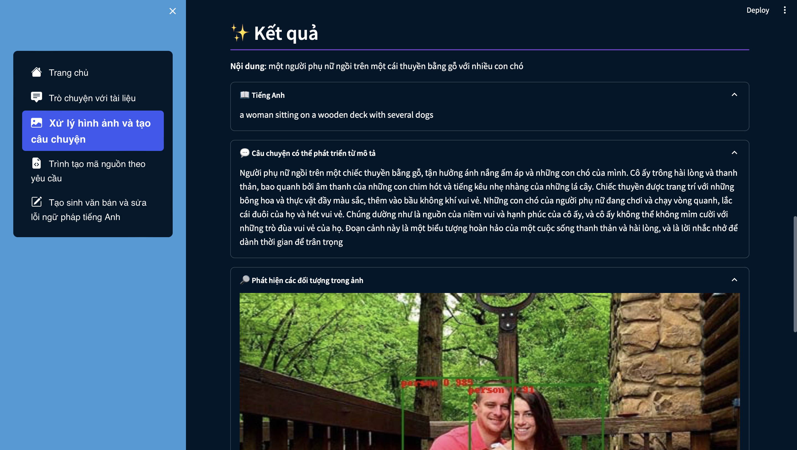
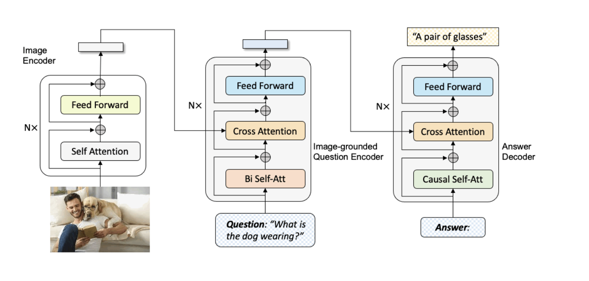
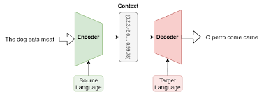
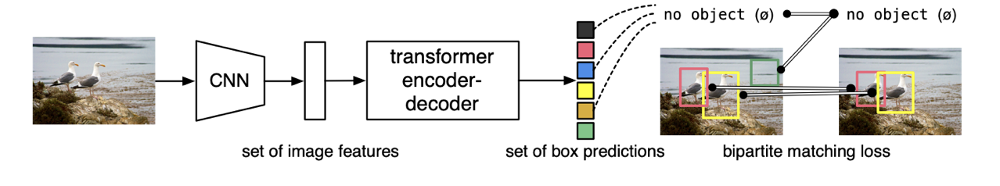

## 4.3. Xử lý hình ảnh và tạo câu chuyện

### 4.3.1. Giao diện và chức năng hoạt động

&emsp;Nhấn chọn Browse files để load hình ảnh bạn muốn xử lý.

&emsp;Sau khi hình ảnh đã được load lên sẽ có giao diện như sau:

&emsp;Nội dung tóm tắt của hình ảnh sẽ được hiển thị ngay bên dưới hình ảnh.

&emsp;Đi cùng với đó là 3 mục bạn có thể chọn để xem bao gồm: Tiếng Anh, Câu chuyện có thể phát triển từ mô tả, Phát hiện các đối tượng trong ảnh.

- Với mục "Tiếng Anh", bạn có thể xem mô tả của bức ảnh bằng tiếng Anh.
- Với mục "Câu chuyện có thể phát triển từ mô tả", bạn có thể xem 1 câu chuyện ngắn được phát triển từ đoạn mô tả bức ảnh để có thể hình dung tổng quát nội dung của bức ảnh.
- Với mục "Phát hiện các đối tượng trong ảnh", bạn có thể nhận biết được các đối tượng bên trong ảnh.

### 4.3.2. Tóm tắt quy trình hoạt động của chức năng

Hình ảnh -> Phân tích văn bản (Image to Text) -> Dịch văn bản (Translate)
|
|-> Tạo câu chuyện (Generate Story)
|
|-> Phát hiện đối tượng (Object Detection)

### 4.3.3. Kiến trúc của mô hình

- Image-to-Text Model (Salesforce/blip-image-captioning-base):
  - Sử dụng để chuyển đổi hình ảnh thành văn bản mô tả.
  - Được sử dụng trong hàm img2text(url).

- MBart Model (facebook/mbart-large-50-many-to-many-mmt):
  - Một mô hình ngôn ngữ mạng transformer dựa trên kiến trúc BART (Bidirectional and Auto-Regressive Transformers).
  - Được sử dụng để dịch từ văn bản tiếng Anh sang tiếng Việt.
  - Được sử dụng trong hàm translate_article_Eng_Viet(article_hi) và generate_story(scenario, llm).

- Detr Model (facebook/detr-resnet-50):
  - Một mô hình dùng cho phát hiện đối tượng trong hình ảnh. Sử dụng mô hình DETR (DEtection TRansformer).
  - Được sử dụng để phát hiện đối tượng trong hình ảnh và vẽ bounding boxes và nhãn tương ứng lên ảnh.
  - Được sử dụng trong hàm detect_objects_and_draw_bounding_boxes(url).

### 4.3.4. Nhận xét về chức năng

#### a. Điểm mạnh:
- Ứng dụng cho phép người dùng tải lên hình ảnh và tự động trích xuất văn bản từ hình ảnh đó.
- Giao diện người dùng thân thiện và dễ sử dụng, với các phần mở rộng giúp người dùng khám phá chi tiết kết quả.
#### b. Hạn chế:
- Vì các model không hỗ trợ tiếng việt nên phải sử dụng thêm 1 model để có thể dịch từ tiếng Anh sang tiếng Việt. Điều này làm mất khá nhiều thời gian để xử lý và không hiệu quả.
- Câu chuyện được tạo ra từ mô tả còn nhiều hạn chế với những câu không được ý nghĩa.
- Phát hiện các đối tượng trong bức ảnh chỉ ở mức khá.